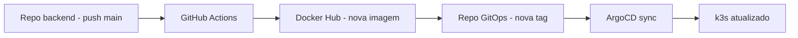

# Configurando o GitHub Actions para CD

Agora vamos configurar o workflow no repositório da aplicação para completar o ciclo de CD.

Repositório alvo desta etapa:

- <http://github.com/eduardo-da-silva/registro-atividades-backend-devops>

## Objetivo do workflow

A cada push na `main`, o pipeline deve:

1. Executar testes.
2. Fazer build e push da imagem para o Docker Hub.
3. Atualizar o `kustomization.yaml` no repositório GitOps com a nova tag.

## 1. Configurar secrets no GitHub

No repositório da aplicação, acesse:

- `Settings` -> `Secrets and variables` -> `Actions`

Crie estes secrets:

- `DOCKERHUB_USERNAME`
- `DOCKERHUB_TOKEN`
- `GITOPS_TOKEN` (token pessoal para escrever no repo GitOps)
- `GITOPS_REPO` (exemplo: `eduardo-da-silva/registro-atividades-k8s`)

### Como obter o GITOPS_TOKEN

O `GITOPS_TOKEN` é um **Personal Access Token (PAT)** do GitHub que permite ao workflow fazer push no repositório GitOps.

**Passo 1**: No GitHub, clique em sua foto de perfil → **Settings** → **Developer settings** → **Personal access tokens** → **Tokens (classic)** (ou **Fine-grained tokens** se preferir mais controle).

**Passo 2**: Clique em **Generate new token** e escolha a opção **classic**.

**Passo 3**: Preencha os campos:

- **Note**: descreva o propósito, ex: `GitHub Actions - CD para registro-atividades-k8s`
- **Expiration**: escolha uma data apropriada (ex: 90 dias)
- **Select scopes**: marque apenas `repo` (acesso ao repositório)

**Passo 4**: Role até o fim e clique **Generate token**.

**Passo 5**: Copie o token exibido. Ele **nunca mais será visível**, então guarde em local seguro.

**Passo 6**: Cole o token no secret `GITOPS_TOKEN` do repositório da aplicação (conforme explicado acima).

!!! info "Permissões do token GitOps"
    O token usado em `GITOPS_TOKEN` precisa de permissão de escrita no repositório GitOps. O scope `repo` garante acesso completo ao repositório.

Também habilite permissões do workflow:

- `Settings` -> `Actions` -> `General` -> `Workflow permissions`
- Selecione: `Read and write permissions`

## 2. Criar workflow de CD

Crie o arquivo `.github/workflows/ci-cd.yml` com o conteúdo abaixo:

```yaml title=".github/workflows/ci-cd.yml" linenums="1"
name: ci-cd-backend

on:
  push:
    branches: [main]
  pull_request:
    branches: [main]

jobs:
  tests:
    runs-on: ubuntu-latest
    steps:
      - uses: actions/checkout@v4

      - uses: actions/setup-python@v5
        with:
          python-version: "3.13"
          cache: "pip"

      - run: pip install -r requirements.txt
      - run: pytest

  build-and-push:
    needs: tests
    runs-on: ubuntu-latest
    if: github.event_name == 'push'
    outputs:
      image_tag: ${{ steps.meta.outputs.image_tag }}
    steps:
      - uses: actions/checkout@v4

      - name: Login Docker Hub
        uses: docker/login-action@v3
        with:
          username: ${{ secrets.DOCKERHUB_USERNAME }}
          password: ${{ secrets.DOCKERHUB_TOKEN }}

      - name: Set metadata
        id: meta
        run: echo "image_tag=${GITHUB_SHA}" >> "$GITHUB_OUTPUT"

      - name: Build and push image
        uses: docker/build-push-action@v6
        with:
          context: .
          push: true
          tags: |
            ${{ secrets.DOCKERHUB_USERNAME }}/registro-atividades-backend:latest
            ${{ secrets.DOCKERHUB_USERNAME }}/registro-atividades-backend:${{ steps.meta.outputs.image_tag }}

  update-gitops:
    needs: build-and-push
    runs-on: ubuntu-latest
    if: github.event_name == 'push'
    steps:
      - name: Checkout GitOps repository
        uses: actions/checkout@v4
        with:
          repository: ${{ secrets.GITOPS_REPO }}
          token: ${{ secrets.GITOPS_TOKEN }}
          path: gitops

      - name: Setup Kustomize
        uses: imranismail/setup-kustomize@v2

      - name: Update image tag in kustomization
        run: |
          cd gitops/k8s
          kustomize edit set image \
            ${{ secrets.DOCKERHUB_USERNAME }}/registro-atividades-backend=\
            ${{ secrets.DOCKERHUB_USERNAME }}/registro-atividades-backend:${{ needs.build-and-push.outputs.image_tag }}

      - name: Commit and push
        run: |
          cd gitops
          git config user.name "github-actions"
          git config user.email "github-actions@users.noreply.github.com"
          git add .
          git commit -m "chore: update backend image tag to ${{ needs.build-and-push.outputs.image_tag }}" || echo "No changes to commit"
          git push
```

## 3. Como esse workflow conversa com o ArgoCD

Quando o job `update-gitops` faz push no repositório GitOps, o ArgoCD detecta o novo commit. Se o app estiver com sincronização automática, ele atualiza o cluster sem intervenção manual.



## 4. Teste rápido

1. Faça uma alteração simples no backend.
2. Push na `main`.
3. Confira o workflow no GitHub Actions.
4. Verifique se o `kustomization.yaml` no repo GitOps recebeu nova tag.

Se esse passo funcionar, você já terá o gatilho de CD pronto.
