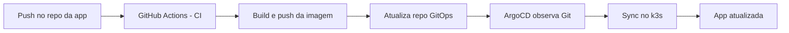

# Entrega Contínua com ArgoCD

Nos capítulos anteriores, automatizamos testes e build de imagem com CI no GitHub Actions. Agora vamos fechar o ciclo com **Entrega Contínua (CD)** no Kubernetes usando **GitOps**.

Nesta trilha, vamos usar:

- Repositório da aplicação: <http://github.com/eduardo-da-silva/registro-atividades-backend-devops>
- Um novo repositório GitOps (somente manifests Kubernetes)
- ArgoCD rodando no cluster k3s do AWS Learner Lab

## O que é Entrega Contínua?

Entrega Contínua é a prática de manter o software sempre em estado de implantação. Em outras palavras: cada mudança aprovada no repositório deve poder chegar ao ambiente com baixo risco, processo repetível e rastreabilidade.

No nosso fluxo, isso acontece assim:

1. O desenvolvedor faz push no repositório da aplicação.
2. O GitHub Actions testa, gera imagem e publica no Docker Hub.
3. O pipeline atualiza o repositório GitOps com a nova tag da imagem.
4. O ArgoCD detecta a mudança no GitOps e sincroniza no Kubernetes.

## O que é GitOps?

GitOps é um modelo operacional onde o estado desejado da infraestrutura e das aplicações fica versionado no Git.

Com isso, ganhamos:

- Histórico completo de mudanças (auditoria)
- Rollback por commit
- Menos mudanças manuais no cluster
- Ambiente mais previsível e reproduzível

No nosso caso, o repositório GitOps terá arquivos YAML Kubernetes e um `kustomization.yaml`.

## O que é ArgoCD e para que serve?

O ArgoCD é uma ferramenta de CD para Kubernetes orientada a GitOps. Ele compara continuamente:

- Estado desejado no Git
- Estado real no cluster

Quando há diferença, ele sincroniza os recursos para voltar ao estado declarado no repositório.

!!! info "Fluxo da aula"
    Esta seção foi organizada em quatro tutoriais práticos: instalação do ArgoCD, criação do repositório GitOps com Kustomize, configuração do GitHub Actions para CD e configuração da aplicação no ArgoCD.

## Pré-requisitos

Antes de iniciar os próximos capítulos, confirme:

- Cluster k3s no AWS Learner Lab já funcional
- `kubectl` configurado para acessar o cluster remoto
- Conta no Docker Hub
- Acesso para criar repositórios e tokens no GitHub

## Passos importantes que faltavam na versão anterior

Além do básico de instalar e criar o app no ArgoCD, um fluxo real de CD precisa destes pontos:

1. Separar repositório de aplicação e repositório GitOps.
2. Usar `kustomization.yaml` para controle declarativo de imagem/tag.
3. Configurar token para o workflow da app atualizar o repo GitOps.
4. Criar e gerenciar os secrets de banco no cluster (sem commitar credenciais no Git).
5. Habilitar sincronização automática no ArgoCD com `prune` e `self-heal`.

Esses pontos serão implementados nos próximos capítulos.
