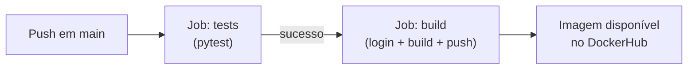

# Deploy para o DockerHub

Até agora, nosso pipeline constrói a imagem Docker mas não a publica em lugar nenhum. Nesta etapa, vamos configurar o push automático da imagem para o **DockerHub**, um registro público de imagens Docker. Dessa forma, a cada push na branch `main`, a imagem será construída, testada e publicada automaticamente.

## Configurando o DockerHub

O DockerHub é um serviço de registro de contêineres que permite armazenar e compartilhar imagens Docker. No fluxo de DevOps, após validar o código com testes automatizados, é comum fazer o upload da imagem para um registro — tornando-a disponível para implantação em qualquer ambiente.

### Criando um token de acesso

Para que o GitHub Actions consiga fazer login no DockerHub de forma segura, precisamos gerar um **token de acesso** (em vez de usar a senha da conta):

1. Acesse sua conta no [DockerHub](https://hub.docker.com/). Crie uma conta gratuita caso ainda não tenha.
2. Clique na sua foto de perfil → **Account Settings**.
3. Na seção **Personal Access Tokens**, clique em **Generate New Token**.
4. Dê um nome descritivo (ex: `github-actions-ci`), defina as permissões como **Read, Write, and Delete** e clique em **Generate**.
5. **Copie o token** e guarde-o em local seguro — ele não será exibido novamente.

### Armazenando credenciais como secrets no GitHub

Agora precisamos armazenar o token e o nome de usuário do DockerHub como **secrets** no repositório do GitHub. Secrets são variáveis criptografadas que ficam acessíveis nos workflows sem ficarem visíveis nos logs.

1. No repositório do GitHub, acesse **Settings** → **Secrets and variables** → **Actions**.
2. Clique em **New repository secret** e crie os dois secrets abaixo:

| Nome do secret | Valor |
|---|---|
| `DOCKERHUB_TOKEN` | O token de acesso gerado no passo anterior |
| `DOCKERHUB_USERNAME` | Seu nome de usuário do DockerHub |

Os secrets ficam disponíveis nos workflows através da sintaxe `${{ secrets.NOME }}`.

## Atualizando o workflow

Com os secrets configurados, vamos editar o job `build` do arquivo `.github/workflows/ci.yml` para fazer login no DockerHub e publicar a imagem. O job `tests` permanece inalterado:

```yaml title=".github/workflows/ci.yml" hl_lines="24-30 36"
name: ci-python
on:
  push:
    branches: [main]
  pull_request:
    branches: [main]
jobs:
  tests:
    runs-on: ubuntu-latest
    steps:
      - uses: actions/checkout@v4

      - uses: actions/setup-python@v5
        with:
          python-version: '3.13'
          cache: 'pip'

      - run: pip install -r requirements.txt

      - run: pytest

  build:
    needs: tests
    runs-on: ubuntu-latest
    if: github.event_name == 'push' # (1)
    steps:
      - uses: actions/checkout@v4

      - name: Login to DockerHub
        uses: docker/login-action@v3
        with:
          username: ${{ secrets.DOCKERHUB_USERNAME }}
          password: ${{ secrets.DOCKERHUB_TOKEN }}

      - name: Set up QEMU
        uses: docker/setup-qemu-action@v3

      - name: Set up Docker Buildx
        uses: docker/setup-buildx-action@v3

      - name: Build and Push to DockerHub
        uses: docker/build-push-action@v6
        with:
          push: true
          tags: | # (2)
            ${{ secrets.DOCKERHUB_USERNAME }}/ci-sum-python:${{ github.sha }}
            ${{ secrets.DOCKERHUB_USERNAME }}/ci-sum-python:latest
```

1. A condição `if: github.event_name == 'push'` garante que o push da imagem só aconteça em pushes diretos para a branch `main`, e **não** em pull requests. Isso evita publicar imagens de código que ainda não foi aprovado.
2. Usamos `${{ secrets.DOCKERHUB_USERNAME }}` na tag em vez de hardcodar o nome de usuário. Também adicionamos duas tags: uma com o hash do commit (`github.sha`) para identificar a versão exata, e `latest` para facilitar o acesso à versão mais recente.

### Estratégia de tags

A escolha de como nomear as tags das imagens é uma decisão importante em projetos reais:

| Estratégia | Exemplo | Quando usar |
|---|---|---|
| Hash do commit | `app:a1b2c3d` | Rastreabilidade exata — cada imagem aponta para um commit específico |
| `latest` | `app:latest` | Conveniência — sempre aponta para a versão mais recente. Não use sozinha em produção. |
| Semântica | `app:1.2.3` | Versionamento formal com `MAJOR.MINOR.PATCH` ([semver.org](https://semver.org/)) |

No nosso exemplo, combinamos o hash do commit com `latest`. Em projetos maiores, é comum usar versionamento semântico automatizado com ferramentas como `semantic-release`.

## Executando o pipeline completo

Faça o commit e o push das alterações:

```bash
git add .github/workflows/ci.yml
git commit -m "Configura push da imagem para DockerHub"
git push
```

Na aba **Actions** do GitHub, você verá o pipeline completo em execução:



Se tudo estiver configurado corretamente, a imagem será publicada no DockerHub. Você pode verificar acessando `https://hub.docker.com/r/seu-usuario/ci-sum-python`.

Para baixar e executar a imagem publicada em qualquer máquina:

```bash
docker pull seu-usuario/ci-sum-python:latest
docker run --rm seu-usuario/ci-sum-python:latest
```

## Resumo

Ao longo deste capítulo, construímos um pipeline de integração contínua completo:

1. **Criamos um projeto Python** com testes automatizados usando `pytest`.
2. **Configuramos o GitHub Actions** para executar testes a cada push e pull request.
3. **Separamos o pipeline em jobs** independentes (`tests` e `build`) com dependência explícita via `needs`.
4. **Automatizamos a publicação** da imagem Docker no DockerHub com login via secrets.

Esse fluxo é representativo do que encontramos em projetos profissionais: o código é validado automaticamente, e os artefatos (neste caso, a imagem Docker) são gerados apenas quando todas as verificações passam.

No próximo capítulo, vamos explorar o que está por trás dos contêineres que usamos aqui — entenderemos os mecanismos do kernel Linux (namespaces e cgroups) que tornam o isolamento de processos possível.
