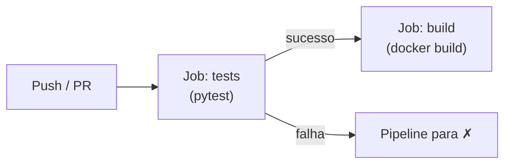

# Configurando o GitHub Actions

Nesta etapa, vamos criar o pipeline de CI no GitHub Actions. Começaremos com um workflow mínimo que executa apenas os testes, e depois o expandiremos para incluir a construção de uma imagem Docker.

## Primeiro workflow: executando testes

Crie a estrutura de diretórios e o arquivo de workflow:

```bash
mkdir -p .github/workflows
```

Crie o arquivo `.github/workflows/ci.yml` com o seguinte conteúdo:

```yaml title=".github/workflows/ci.yml"
name: ci-python
on:
  push:
    branches: [main]
  pull_request:
    branches: [main]
jobs:
  tests:
    runs-on: ubuntu-latest
    steps:
      - uses: actions/checkout@v4

      - uses: actions/setup-python@v5
        with:
          python-version: '3.13'
          cache: 'pip' # (1)

      - run: pip install -r requirements.txt

      - run: pytest
```

1. A opção `cache: 'pip'` instrui a action `setup-python` a armazenar em cache os pacotes baixados pelo `pip`. Nas execuções seguintes, em vez de baixar todos os pacotes novamente, o pipeline reutiliza o cache — o que reduz significativamente o tempo de execução. O cache é invalidado automaticamente quando o arquivo `requirements.txt` muda.

Vamos analisar a estrutura desse workflow, aplicando os conceitos que estudamos na página anterior:

- **`name: ci-python`**: Nome do workflow, exibido na aba Actions do GitHub.
- **`on:`**: Define os **triggers** — este workflow é disparado em pushes para `main` e em pull requests direcionados a `main`. Note que adicionamos o trigger `pull_request`: isso garante que o código de qualquer PR seja validado antes do merge.
- **`jobs:`**: Contém os jobs do workflow. Por enquanto, temos apenas o job `tests`.
- **`runs-on: ubuntu-latest`**: Define o **runner** — uma máquina virtual Ubuntu fornecida pelo GitHub.
- **`steps:`**: A sequência de etapas que compõem o job:
    1. **`actions/checkout@v4`**: Clona o repositório no runner.
    2. **`actions/setup-python@v5`**: Instala o Python 3.13 e configura o cache do pip.
    3. **`pip install`**: Instala as dependências do projeto.
    4. **`pytest`**: Executa os testes.

### Testando o workflow

Faça o commit e o push das alterações:

```bash
git add .github/workflows/ci.yml
git commit -m "Adiciona workflow de CI com testes"
git push
```

Após o push, acesse a aba **Actions** do seu repositório no GitHub. Você verá o workflow `ci-python` em execução. Clique nele para acompanhar os logs de cada step em tempo real.

Se os testes passarem, você verá um check verde ao lado do commit. Se falharem, o check será vermelho e os logs mostrarão exatamente qual teste falhou — esse é o **feedback rápido** que a CI proporciona.

## Adicionando a criação da imagem Docker

Agora que temos os testes rodando automaticamente, vamos expandir o pipeline para também construir uma imagem Docker do projeto. Essa é uma prática comum em pipelines CI: após validar que os testes passam, empacotamos a aplicação em uma imagem pronta para distribuição.

 cat > "/home/eduardo/Documentos/Aulas/Fundamentos DevOps/notas-aula-site/docs/ci/criando-projeto.md" << 'ENDOFFILE'
# Criando o projeto

Neste guia, vamos criar um projeto simples em Python para demonstrar a integração contínua com o GitHub Actions. O projeto consistirá em um script Python que realiza a soma de dois números e exibe o resultado.

## Passo a passo

- [x] Crie um diretório para o projeto.

Crie um diretório para o projeto em sua máquina local e abra-o com o Visual Studio Code ou outro editor de sua preferência.

- [x] Inicialize um repositório Git

Dentro do diretório do projeto, inicialize um repositório Git com o comando:

```bash
git init
```

- [x] Crie um ambiente virtual

Crie um ambiente virtual para o projeto com o comando:

```bash
python -m venv .venv
```

Em seguida, ative o ambiente virtual:

=== "Linux e macOS"

    ```bash
    source .venv/bin/activate
    ```

=== "Windows"

    ```powershell
    .venv\Scripts\activate
    ```

- [x] Configure o .gitignore

Crie um arquivo `.gitignore` na raiz do projeto e adicione o seguinte conteúdo para ignorar o ambiente virtual e os arquivos `.pyc`:

```plaintext title=".gitignore"
.venv
*.pyc
__pycache__/
.pytest_cache/
```

- [x] Instale o `pytest`

Instale o `pytest` para realizar os testes unitários do projeto:

```bash
pip install pytest
```

- [x] Crie um arquivo de testes

Crie um arquivo Python chamado `test_app.py` com o seguinte conteúdo:

```py title="test_app.py"
from app import sumF


def test_sum():
    assert sumF(1, 2) == 3
    assert sumF(2, 2) == 4
    assert sumF(3, 2) == 5

```

Note que estamos escrevendo os **testes antes da implementação**. Essa abordagem é conhecida como **TDD** (_Test-Driven Development_): primeiro definimos o comportamento esperado através de testes, e só depois escrevemos o código que os satisfaz. O ciclo do TDD segue três passos: (1) escrever um teste que falha, (2) implementar o código mínimo para fazê-lo passar, e (3) refatorar se necessário.

Se rodarmos os testes agora, eles devem falhar, pois ainda não implementamos a função `sumF`. Para testar, execute o comando:

```bash
pytest
```

- [x] Crie um arquivo Python

Crie um arquivo Python chamado `app.py` com o seguinte conteúdo:

```python title="app.py"
def sumF(a, b):
    return a + b


if __name__ == "__main__":
    print(sumF(10, 10))
```

- [x] Execute os testes

Execute os testes novamente com o comando `pytest`. Eles devem passar agora, pois a função `sumF` foi implementada e está correta.

- [x] Crie um arquivo `requirements.txt`

Crie um arquivo `requirements.txt` com as dependências do projeto:

```bash
pip freeze > requirements.txt
```

## Publicando no GitHub

Neste momento, precisamos publicar o projeto no GitHub para que possamos configurar o GitHub Actions na próxima etapa.

**Passo 1**: Crie um novo repositório no GitHub (pela interface web ou pelo CLI `gh`). Não inicialize com README ou `.gitignore` — já temos esses arquivos localmente.

**Passo 2**: Adicione o repositório remoto e faça o push:

```bash
git add .
git commit -m "Projeto inicial com testes"
git branch -M main
git remote add origin https://github.com/seu-usuario/ci-sum-python.git
git push -u origin main
```

Substitua `seu-usuario` pelo seu nome de usuário no GitHub e `ci-sum-python` pelo nome que você escolheu para o repositório.

Após o push, verifique na interface do GitHub que todos os arquivos (`app.py`, `test_app.py`, `requirements.txt`, `.gitignore`) estão presentes no repositório. Na próxima página, vamos configurar o GitHub Actions para executar os testes automaticamente a cada push.
ENDOFFILE! info "Sobre Docker"
    Se ainda não conhece Docker, trate o Dockerfile abaixo como uma "receita" que empacota a aplicação. Os detalhes serão aprofundados nos capítulos de Contêineres e Docker.

### Criando o Dockerfile

Crie um arquivo `Dockerfile` na raiz do projeto:

```Dockerfile title="Dockerfile"
FROM python:3.13-slim
WORKDIR /app
COPY requirements.txt requirements.txt
RUN pip install -r requirements.txt
COPY app.py app.py
CMD ["python", "app.py"]
```

Esse arquivo define como construir uma imagem Docker para a aplicação:

- `FROM python:3.13-slim`: Usa uma imagem Python compacta como base.
- `WORKDIR /app`: Define o diretório de trabalho dentro do contêiner.
- `COPY requirements.txt` + `RUN pip install`: Copia e instala as dependências (antes do código-fonte, para aproveitar o cache de camadas).
- `COPY app.py app.py`: Copia o código da aplicação.
- `CMD ["python", "app.py"]`: Define o comando executado ao iniciar o contêiner.

Note que não incluímos o `pytest` no contêiner — os testes são executados no pipeline CI, antes do build da imagem.

### Testando localmente (opcional)

Se já tiver o Docker instalado, você pode testar a imagem localmente:

```bash
docker build -t ci-sum-python .
docker run --rm ci-sum-python
```

O comando `docker run` deve exibir a saída `20` (resultado de `sumF(10, 10)`).

### Adicionando o build ao workflow

Agora, vamos adicionar um **segundo job** ao workflow para construir a imagem Docker. Esse job só será executado após o job de testes passar — essa dependência é declarada com a palavra-chave `needs`:

Edite o arquivo `.github/workflows/ci.yml`:

```yaml title=".github/workflows/ci.yml" hl_lines="17-30"
name: ci-python
on:
  push:
    branches: [main]
  pull_request:
    branches: [main]
jobs:
  tests:
    runs-on: ubuntu-latest
    steps:
      - uses: actions/checkout@v4

      - uses: actions/setup-python@v5
        with:
          python-version: '3.13'
          cache: 'pip'

      - run: pip install -r requirements.txt

      - run: pytest

  build:
    needs: tests # (1)
    runs-on: ubuntu-latest
    steps:
      - uses: actions/checkout@v4

      - name: Set up QEMU
        uses: docker/setup-qemu-action@v3 # (2)

      - name: Set up Docker Buildx
        uses: docker/setup-buildx-action@v3

      - name: Build
        uses: docker/build-push-action@v6 # (3)
        with:
          push: false
```

1. `needs: tests` declara que o job `build` depende do job `tests`. Ele só será executado se `tests` terminar com sucesso. Sem essa declaração, os jobs rodariam em paralelo.
2. O QEMU permite a construção de imagens para múltiplas arquiteturas (ex: `arm64`, `amd64`). O Buildx é uma extensão do Docker que habilita builds avançados.
3. A opção `push: false` indica que a imagem será apenas construída, sem ser enviada a nenhum registro. Configuraremos o push para o DockerHub na próxima página.

### Testando o pipeline expandido

Faça o commit e o push:

```bash
git add Dockerfile .github/workflows/ci.yml
git commit -m "Adiciona build Docker ao pipeline CI"
git push
```

Na aba Actions, você verá agora **dois jobs**: `tests` e `build`. O job `build` ficará aguardando até que `tests` termine com sucesso. Essa separação em jobs distintos traz duas vantagens: (1) fica claro qual etapa falhou em caso de erro, e (2) os jobs podem usar runners diferentes se necessário.


