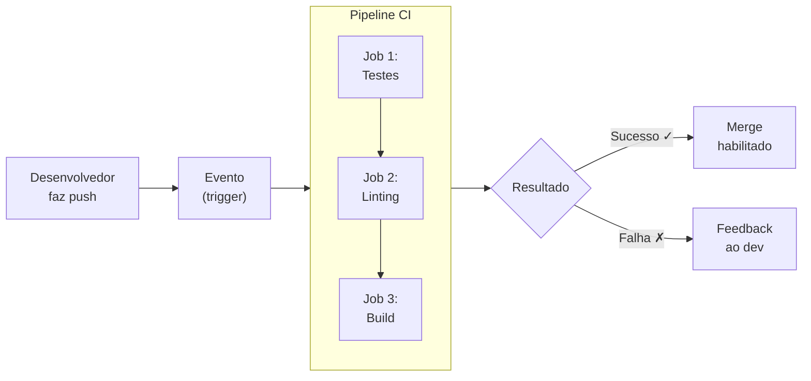
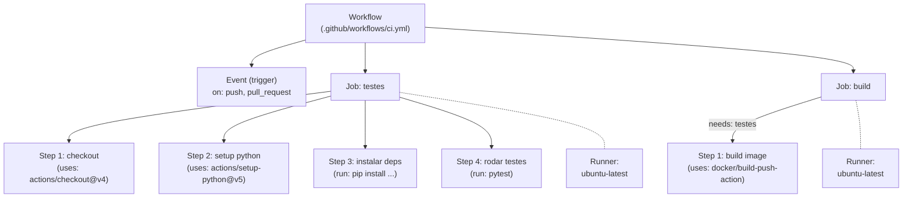

# Integração Contínua

No capítulo anterior, estudamos como equipes colaboram usando branches, pull requests e code review. Essas práticas estruturam o trabalho em equipe, mas, por si só, não garantem que o código integrado funcione corretamente. A **Integração Contínua** (CI — _Continuous Integration_) é a prática que fecha esse ciclo: cada contribuição enviada ao repositório é automaticamente validada por um pipeline de verificações antes de ser aceita.

## O que é Integração Contínua?

Integração Contínua é uma prática de engenharia de software na qual os desenvolvedores integram seu código em um repositório compartilhado com frequência — de preferência várias vezes ao dia. Cada integração é verificada por um **pipeline automatizado** que executa tarefas como compilação, testes e análise de código, fornecendo feedback rápido sobre a qualidade da mudança.

O conceito foi popularizado por Martin Fowler e Kent Beck como parte da metodologia Extreme Programming (XP) no final dos anos 1990. A ideia central é simples: se integrar código é doloroso, faça isso com mais frequência — e automatize a validação.

O diagrama abaixo ilustra o fluxo típico de um pipeline de CI:



## O que um pipeline CI pode fazer?

Um pipeline é uma sequência de **jobs** (tarefas) que são executados automaticamente em resposta a um evento. Entre as verificações mais comuns em pipelines CI, destacam-se:

| Verificação | Descrição | Exemplo de ferramenta |
|---|---|---|
| **Testes automatizados** | Execução de testes unitários, de integração e end-to-end | `pytest`, `jest`, `JUnit` |
| **Linting e formatação** | Análise estática para identificar problemas de estilo e más práticas | `ruff`, `eslint`, `checkstyle` |
| **Cobertura de testes** | Mensuração da porcentagem do código exercitada pelos testes | `pytest-cov`, `istanbul` |
| **Análise de segurança** | Verificação de vulnerabilidades em dependências e no código | `trivy`, `dependabot`, `bandit` |
| **Build de artefatos** | Compilação do código ou construção de imagens de contêiner | `docker build`, `gradle`, `maven` |
| **Versionamento** | Geração automática de tags, versões e changelogs | `semantic-release` |

Na prática, quando a equipe configura um pipeline CI no repositório, cada push ou pull request dispara automaticamente essas verificações em um ambiente limpo e reprodutível. Se qualquer etapa falha, o desenvolvedor recebe feedback imediato e pode corrigir o problema antes que ele se propague para o restante da equipe. Essa é a essência do CI: **feedback rápido e contínuo**.

## Ferramentas de CI

Existem diversas ferramentas para implementar pipelines de integração contínua. O quadro abaixo compara as principais opções disponíveis no mercado:

| Ferramenta | Hospedagem | Integração nativa | Observações |
|---|---|---|---|
| **GitHub Actions** | SaaS (GitHub) | GitHub | Gratuito para repositórios públicos. Configuração via YAML no repositório. |
| **GitLab CI/CD** | SaaS ou self-hosted | GitLab | Integrado ao GitLab. Runners próprios ou compartilhados. |
| **Jenkins** | Self-hosted | Qualquer (via plugins) | Open source, altamente extensível. Requer infraestrutura dedicada. |
| **CircleCI** | SaaS ou self-hosted | GitHub, Bitbucket | Boa experiência com Docker. Plano gratuito limitado. |
| **Azure DevOps** | SaaS | Azure, GitHub | Integração forte com ecossistema Microsoft. |

Neste curso, utilizaremos o **GitHub Actions**, pois é integrado nativamente ao GitHub (que já estamos usando), não requer infraestrutura adicional e possui uma comunidade ativa com milhares de _actions_ reutilizáveis disponíveis no [GitHub Marketplace](https://github.com/marketplace?type=actions).

## Conceitos do GitHub Actions

Antes de criar nosso primeiro pipeline, é fundamental entender a terminologia do GitHub Actions. Os conceitos abaixo são a base para compreender qualquer workflow:

- **Workflow**: Um processo automatizado definido em um arquivo YAML dentro do diretório `.github/workflows/` do repositório. Um repositório pode ter múltiplos workflows.
- **Event (trigger)**: O evento que dispara a execução do workflow. Exemplos: `push`, `pull_request`, `schedule` (cron), `workflow_dispatch` (manual).
- **Job**: Um conjunto de _steps_ que são executados no mesmo _runner_. Um workflow pode ter múltiplos jobs, que por padrão rodam em **paralelo**.
- **Step**: Uma tarefa individual dentro de um job. Pode ser um comando shell (`run:`) ou uma _action_ reutilizável (`uses:`).
- **Runner**: A máquina (virtual) onde o job é executado. O GitHub oferece runners gratuitos com Ubuntu, Windows e macOS.
- **Action**: Um componente reutilizável que encapsula uma tarefa comum (ex: `actions/checkout@v4` faz o clone do repositório). Disponíveis no [GitHub Marketplace](https://github.com/marketplace?type=actions).
- **Secret**: Um valor sensível (tokens, senhas) armazenado de forma criptografada no repositório e acessível nos workflows via `${{ secrets.NOME }}`.
- **Artifact**: Arquivos gerados durante o pipeline (binários, relatórios, logs) que podem ser baixados ou passados entre jobs.

O diagrama abaixo mostra como esses conceitos se relacionam na estrutura de um arquivo YAML:



## Tipos de triggers

O GitHub Actions suporta diversos tipos de eventos para disparar workflows. Os mais utilizados em pipelines CI são:

```yaml
on:
  # Dispara em qualquer push para as branches listadas
  push:
    branches: [main, develop]

  # Dispara quando um pull request é aberto ou atualizado
  pull_request:
    branches: [main]

  # Dispara em um cronograma (sintaxe cron)
  schedule:
    - cron: '0 6 * * 1'  # toda segunda-feira às 6h UTC

  # Permite disparar manualmente pela interface do GitHub
  workflow_dispatch:
```

O trigger `pull_request` é particularmente importante em pipelines CI: ele permite que o código seja validado **antes** do merge, garantindo que a branch principal sempre contenha código funcional. Essa é a conexão direta entre o que estudamos em pull requests/code review e a integração contínua.

 wc -l "/home/eduardo/Documentos/Aulas/Fundamentos DevOps/notas-aula-site/docs/ci/index.md"! info "Nota sobre Docker neste capítulo"
    Nas próximas páginas, construiremos uma imagem Docker como parte do pipeline CI. Se você ainda não trabalhou com Docker, não se preocupe — as instruções são autocontidas e explicam cada passo. Os fundamentos de contêineres e Docker serão aprofundados nos capítulos seguintes.
