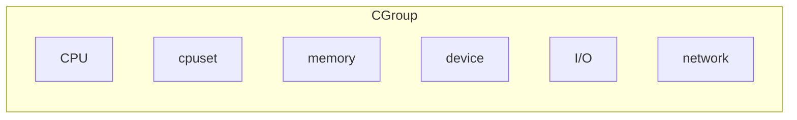
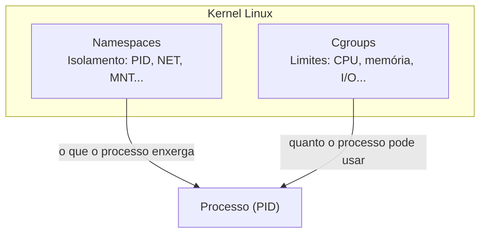

# CGroups (ou Control Groups)

Na seção anterior, exploramos os namespaces, que controlam **o que** um processo enxerga. Agora vamos estudar os **cgroups**, o mecanismo do kernel Linux responsável por controlar **quanto** cada processo pode consumir de recursos como CPU, memória e I/O.

## O que são cgroups?

Os cgroups (control groups) são uma característica do núcleo do Linux que permite limitar e monitorar o uso de recursos (como CPU, memória e disco) por processos em um contêiner. Isso ajuda a garantir que os contêineres não consumam mais recursos do que o necessário e permite que os desenvolvedores definam limites para cada contêiner.

Os cgroups são organizados em hierarquias, onde cada hierarquia pode conter vários grupos de controle. Cada grupo de controle pode ter suas próprias configurações de limite de recursos, permitindo que os desenvolvedores definam diferentes limites para diferentes grupos de processos.

Os cgroups são usados para controlar o uso de recursos em várias áreas, incluindo:

- **Limitação de CPU**: Permite definir limites de uso de CPU para grupos de processos, garantindo que um contêiner não consuma mais CPU do que o necessário.
- **Limitação de memória**: Permite definir limites de uso de memória para grupos de processos, garantindo que um contêiner não consuma mais memória do que o necessário.
- **Limitação de disco**: Permite definir limites de uso de disco para grupos de processos, garantindo que um contêiner não consuma mais espaço em disco do que o necessário.
- **Limitação de rede**: Permite definir limites de uso de rede para grupos de processos, garantindo que um contêiner não consuma mais largura de banda do que o necessário.
- **Limitação de I/O**: Permite definir limites de uso de entrada/saída (I/O) para grupos de processos, garantindo que um contêiner não consuma mais recursos de I/O do que o necessário.



Os cgroups são uma parte fundamental da tecnologia de contêineres, pois permitem que os desenvolvedores definam limites e monitorem o uso de recursos em contêineres. Isso é especialmente importante em ambientes de produção, onde vários contêineres podem estar sendo executados simultaneamente e o uso excessivo de recursos por um contêiner pode afetar o desempenho de outros contêineres ou do sistema host.
Por isso, junto com os namespaces, os cgroups são fundamentais para garantir o isolamento e o controle de recursos em contêineres. Eles permitem que os desenvolvedores definam limites e monitorem o uso de recursos, garantindo que os contêineres não afetem o desempenho do sistema host ou de outros contêineres.

## Criando um ambiente isolado com cgroups

Nós vamos limitar os recursos do namespace criado anteriormente e, em seguida, rodar um teste de estresse para verificar se os limites estão funcionando corretamente.

Antes de partirmos para a prática, é importante entender a relação entre namespaces e cgroups. Embora ambos sejam mecanismos do kernel Linux usados em contêineres, eles resolvem problemas diferentes:

- **Namespaces** controlam **o que** um processo enxerga — processos, rede, sistema de arquivos, etc. (isolamento)
- **Cgroups** controlam **quanto** um processo pode usar — CPU, memória, I/O, etc. (limitação de recursos)

Esses dois mecanismos são **independentes** entre si. Um cgroup não "sabe" que o processo pertence a um namespace, e vice-versa. A ligação entre eles é feita por meio do **PID do processo**: ao adicionar o PID de um processo ao arquivo `cgroup.procs` de um cgroup, todos os filhos desse processo (incluindo tudo que roda dentro do namespace criado pelo `unshare`) herdam automaticamente os limites de recursos definidos.

É exatamente isso que o Docker faz internamente: para cada contêiner, ele cria namespaces (para isolamento) **e** um cgroup (para limitar recursos), associando o processo principal do contêiner a ambos.



Inicialmente, vamos criar alguns arquivos com as definições do cgroup que iremos associar ao processo bash que criamos anteriormente. Para isso, vamos criar um diretório para o cgroup e configurar os limites de CPU e memória.

**Terminal do host:**

```bash
sudo mkdir /sys/fs/cgroup/meu-cgroup # (1)
```

1. O nome `meu-cgroup` pode ser alterado para qualquer nome que você preferir. O importante é que o diretório seja criado dentro de `/sys/fs/cgroup/`, que é onde os cgroups são montados no sistema.

Agora vamos limitar os recursos do cgroup. Para isso, vamos criar dois arquivos: `cpu.max` e `memory.max`. O arquivo `cpu.max` define o limite de uso de CPU, enquanto o arquivo `memory.max` define o limite de uso de memória.

```bash
echo "50000 100000" | sudo tee /sys/fs/cgroup/meu-cgroup/cpu.max # (1)
echo "100M" | sudo tee /sys/fs/cgroup/meu-cgroup/memory.max # (2)
```

1. O valor `50000 100000` significa que o cgroup pode usar até 50% de um núcleo de CPU (50.000 microssegundos em 100.000 microssegundos).
2. O valor `100M` significa que o cgroup pode usar até 100 MB de memória.

No exemplo acima, foram criados os dois arquivos `cpu.max` e `memory.max` dentro do diretório `/sys/fs/cgroup/meu-cgroup/`. Esses arquivos são usados para definir os limites de CPU e memória do cgroup. Você pode confirmar o conteúdo dos arquivos usando o comando `cat`:

```bash
cat /sys/fs/cgroup/meu-cgroup/cpu.max
cat /sys/fs/cgroup/meu-cgroup/memory.max
```

Agora que temos o cgroup criado e os limites definidos, precisamos associar o processo bash que criamos anteriormente (aquele rodando dentro do namespace isolado) a esse cgroup.

**Terminal do namespace (isolado):** Para descobrir o PID, execute:

```bash
echo $$
```

Esse comando exibirá o PID do processo bash dentro do namespace. Contudo, como o namespace de PID é isolado, o PID visto de dentro do namespace (geralmente `1`) é diferente do PID real no host. Para encontrar o PID real, use o `pstree` ou `ps` conforme demonstrado na seção anterior.

**Terminal do host:** Para associar esse processo ao cgroup, adicione o PID (real, visto do host) ao arquivo `cgroup.procs`:

```bash
echo <PID_REAL> | sudo tee /sys/fs/cgroup/meu-cgroup/cgroup.procs # (1)
```

1. Substitua `<PID_REAL>` pelo PID do processo bash que você encontrou usando `pstree` ou `ps -ef | grep unshare` na etapa anterior.

A partir deste momento, o processo bash e **todos os seus filhos** (ou seja, qualquer comando executado dentro do namespace) estarão limitados pelos recursos definidos no cgroup. Note que o cgroup não se importa se o processo está em um namespace ou não — ele apenas limita o processo identificado pelo PID e seus descendentes.

### Fazendo um teste de stress

O Linux fornece uma ferramenta chamada `stress` que pode ser usada para gerar carga em CPU, memória e disco. Essa ferramenta é útil para testar os limites de recursos definidos em um cgroup.

**Terminal do namespace (isolado):** Vamos considerar o comando abaixo:

```bash
stress --cpu 2 --vm 1 --vm-bytes 80M --timeout 30
```

Esse comando faz o seguinte:

- `--cpu 2`: Cria dois processos que consomem CPU.
- `--vm 1`: Cria um processo que consome memória.
- `--vm-bytes 80M`: O processo de memória consome 80 MB de memória.
- '--timeout 30': O comando será executado por 30 segundos.

Como a gente pode ver, o comando `stress` vai tentar consumir 80 MB de memória e 2 núcleos de CPU. No entanto, como definimos um limite de 100 MB de memória e 50% de CPU no cgroup, o comando `stress` deve ser limitado a esses valores. Por outro lado, se o comando for executado fora do cgroup, ele não terá esses limites e poderá consumir mais recursos do que o esperado.

**Terminal do host:** Para verificar os limites que foram impostos pelo cgroup, é possível analisar os registros do arquivo `cpu.stat` do cgroup. Esse arquivo contém informações sobre o uso de CPU e o número de vezes que o cgroup foi limitado (_throttled_).

```bash
cat /sys/fs/cgroup/meu-cgroup/cpu.stat
```

Após executar o teste de estresse, a saída esperada será semelhante a:

```
usage_usec 14837292
user_usec 14767292
system_usec 70000
nr_periods 298
nr_throttled 147
throttled_usec 13269498
```

Os campos mais relevantes são:

- `usage_usec`: Tempo total de CPU usado pelo cgroup (em microssegundos).
- `nr_throttled`: Quantas vezes o cgroup foi limitado (_throttled_). Um valor maior que zero indica que o limite de CPU está sendo aplicado.
- `throttled_usec`: Tempo total durante o qual o cgroup ficou impedido de usar CPU (em microssegundos).

Se `nr_throttled` for zero, o limite de CPU não foi atingido durante o teste.

### Testando o limite de memória

**Terminal do namespace (isolado):** Para verificar o limite de memória, execute o comando `stress` com um valor de memória que ultrapasse o limite definido no cgroup:

```bash
stress --vm 1 --vm-bytes 150M --timeout 30
```

Como o limite de memória do cgroup é 100 MB, o kernel irá encerrar o processo que ultrapassar esse limite (_OOM Kill_ — Out of Memory Kill). Você verá uma mensagem de erro indicando que o processo foi encerrado.

**Terminal do host:** Para confirmar o OOM Kill, verifique o log do sistema:

```bash
dmesg | tail -20
```

Você deverá encontrar uma mensagem semelhante a `Memory cgroup out of memory: Killed process ...`, confirmando que o cgroup está aplicando o limite de memória corretamente.

!!!note "Importante"

    1. Crie um novo cgroup para cada teste, para garantir que não haja valores acumulados no `cpu.stat` de execuções anteriores

    2. Remova o cgroup após o teste e o encerramento do namespace:

    ```bash
    sudo rmdir /sys/fs/cgroup/meu-cgroup
    ```
