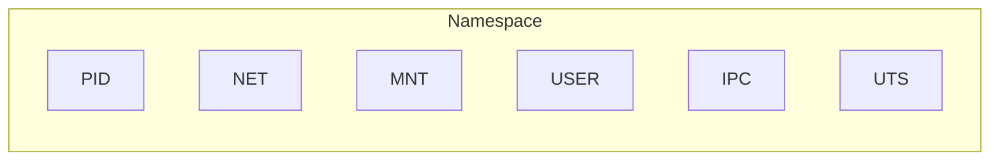
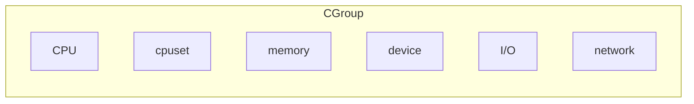

# Contêineres

Nesta seção, abordaremos os conceitos básicos de containers, sem entrar nos detalhes de uso dos famosos Docker e Kubernetes. Vamos nos concentrar nos conceitos fundamentais e na importância dos containers no desenvolvimento de software moderno.

## Fundamentos dos contêineres

O uso de `containers` (ou contêineres) é uma prática comum no desenvolvimento de software moderno, permitindo que os desenvolvedores criem, testem e implantem aplicativos de forma consistente em diferentes ambientes. Os containers são unidades leves e portáteis que empacotam o código-fonte, bibliotecas e dependências necessárias para executar um aplicativo, garantindo que ele funcione da mesma forma em qualquer lugar.

De forma resumida, um contêiner é um ambiente completo, composto por uma aplicação e todas suas dependências, bibliotecas, binários, arquivos de configuração, em um único pacote. Os containers são baseados na tecnologia de virtualização, mas diferentemente das máquinas virtuais, que virtualizam todo o sistema operacional, os containers compartilham o mesmo núcleo do sistema operacional host. Isso torna os containers mais leves e rápidos de iniciar, além de permitir que vários containers sejam executados simultaneamente em um único host.

Ao criar um contêiner para uma aplicação e suas dependências, as diferenças entre distribuições de sistemas operacionais e camadas inferiores da infraestrutura são abstraídas. Com isso, os desenvolvedores podem se concentrar em escrever código e aplicações, sem se preocupar com as diferenças entre os ambientes de desenvolvimento, teste e produção.

### O que são contêineres?

Os contêineres são unidades de software que empacotam o código-fonte, bibliotecas e dependências necessárias para executar um aplicativo. Eles são isolados uns dos outros e do sistema operacional host, o que significa que cada contêiner pode ter suas próprias configurações e dependências, sem interferir em outros contêineres ou no sistema operacional subjacente.

Os contêineres são ambientes de leves, portáteis, consistentes e isolados que permitem aos desenvolvedores executar e empacotar aplicativos com suas dependências de forma consistente em diferentes plataformas. Eles ajudam a simplificar os processos de desenvolvimento, implantação e gerenciamento de aplicativos, garantindo que os aplicativos sejam executados de forma consistente, independentemente da infraestrutura subjacente.

### Por que usar contêineres?

Os contêineres oferecem várias vantagens em relação aos métodos tradicionais de desenvolvimento e implantação de aplicativos. Algumas das principais razões para usar contêineres incluem:

- **Consistência**: Os contêineres garantem que o aplicativo funcione da mesma forma em diferentes ambientes, eliminando problemas de "funciona na minha máquina". Isso é especialmente útil quando se trabalha em equipes grandes ou em projetos complexos.
- **Portabilidade**: Os contêineres podem ser executados em qualquer lugar, desde o laptop do desenvolvedor até servidores em nuvem ou ambientes de produção. Isso facilita a migração de aplicativos entre diferentes ambientes e plataformas.
- **Isolamento**: Os contêineres são isolados uns dos outros, o que significa que as dependências e configurações de um contêiner não afetam outros contêineres ou o sistema operacional host. Isso ajuda a evitar conflitos de dependência e facilita o gerenciamento de aplicativos complexos.
- **Eficiência**: Os contêineres são mais leves e rápidos de iniciar do que as máquinas virtuais, permitindo que vários contêineres sejam executados simultaneamente em um único `host`. Isso reduz o uso de recursos e melhora a eficiência geral do sistema.
- **Escalabilidade**: Os contêineres podem ser facilmente escalados para atender à demanda, permitindo que os desenvolvedores aumentem ou diminuam rapidamente a capacidade de um aplicativo conforme necessário. Isso é especialmente útil em ambientes de produção, onde a carga de trabalho pode variar significativamente.
- **Facilidade de gerenciamento**: Os contêineres podem ser facilmente gerenciados e orquestrados usando ferramentas como Docker e Kubernetes, permitindo que os desenvolvedores automatizem tarefas comuns, como implantação, escalonamento e monitoramento de aplicativos.

Os contêineres resolvem o problema de ambientes inconsistentes ao trabalhar em grandes equipes. Antes dos contêineres ou ambientes virtuais, muitos problemas e perda de tempo eram causados pela necessidade de instalar e configurar ambientes locais para construir projetos compartilhados por colegas de trabalho ou amigos.

Dessa forma, os contêineres ajudam a reduzir o tempo de desenvolvimento e a aumentar a eficiência, permitindo que os desenvolvedores se concentrem no que realmente importa: escrever código e criar aplicativos incríveis. Ainda, de forma geral, o uso de contêineres ajudar a reduzir os conflitos entre as equipes de desenvolvimento e operações, separando as áreas de responsabilidade. Os desenvolvedores podem se concentrar em seus aplicativos e as equipes de operações podem se concentrar na infraestrutura. E, como os contêineres são baseados em tecnologia de código aberto, você obtém os mais recentes avanços assim que estão disponíveis.

Embora o Docker possa ser a ferramenta de contêiner mais conhecida, existem outras opções disponíveis, como Podman, Skopeo, Buildah e CRI-O. Essas ferramentas oferecem funcionalidades semelhantes ao Docker, mas podem ter diferenças em termos de arquitetura, desempenho e recursos específicos.

### Bare Metal vs Virtualização vs Contêineres

`Bare Metal` é um termo usado para descrever um computador que está executando diretamente no hardware sem nenhuma virtualização. Esta é a maneira com maior desempenho para executar um aplicativo, mas também é a menos flexível. Você só pode executar um aplicativo por servidor e não pode mover facilmente o aplicativo para outro servidor.

Para resolver esse problema, a virtualização foi introduzida. A virtualização permite que você execute vários sistemas operacionais em um único servidor. A cada uma dessas instâncias de sistema operacional é chamada de máquina virtual (VM). Cada VM é executada em cima de um hipervisor, que é um pedaço de software que emula o hardware de um computador. O hipervisor permite que você execute vários sistemas operacionais em um único servidor e também fornece isolamento entre aplicativos executados em diferentes VMs.

Isso é possível porque o hipervisor emula o hardware de um computador, permitindo que cada VM tenha seu próprio sistema operacional e recursos. Em linhas gerais, o hipervisor `engana` o sistema operacional convidado (VM) para pensar que está executando em um hardware físico, quando na verdade está sendo executado em cima de outro sistema operacional (o hipervisor). No entanto, isso pode levar a uma sobrecarga de desempenho, pois o hipervisor precisa gerenciar os recursos do hardware subjacente e alocar esses recursos para cada VM. Além disso, o hipervisor pode introduzir latência e reduzir o desempenho geral do sistema.

Já os contêineres são uma maneira de executar vários aplicativos em um único servidor sem a sobrecarga de um hipervisor. Cada contêiner é executado em cima de um mecanismo de contêiner (software que gerencia o ciclo de vida dos contêineres), que supervisiona e isola processos usando os recursos do núcleo do sistema operacional host.

Dessa forma, os contêineres compartilham o mesmo núcleo do sistema operacional host, mas cada contêiner tem seu próprio sistema de arquivos, rede e processos. Isso significa que os contêineres são mais leves e rápidos de iniciar do que as VMs, pois não precisam emular todo o hardware de um computador. Além disso, os contêineres podem ser facilmente movidos entre diferentes servidores e ambientes, tornando-os mais portáteis e flexíveis. Por outro lado, como todos os contêineres usam o mesmo núcleo do sistema operacionais, não é possível que cada contêiner tenha seu próprio sistema operacional. Isso pode levar a problemas de compatibilidade entre aplicativos que exigem diferentes versões do núcleo do sistema operacional.

### Open Container Initiative (OCI)

A Open Container Initiative (OCI) é uma organização que visa criar padrões abertos para contêineres. A OCI foi criada em 2015 como parte da Linux Foundation e tem como objetivo promover a interoperabilidade entre diferentes ferramentas e plataformas de contêineres.

A OCI define dois padrões principais:

- **Runtime Specification**: Define como os contêineres devem ser executados em um ambiente de contêiner. Isso inclui detalhes sobre como os contêineres devem ser iniciados, parados e gerenciados, bem como como os recursos do sistema devem ser alocados para os contêineres.
- **Image Specification**: Define como as imagens de contêiner devem ser formatadas e armazenadas. Isso inclui detalhes sobre como as imagens devem ser empacotadas, versionadas e distribuídas.

Esses padrões ajudam a garantir que diferentes ferramentas e plataformas de contêineres possam trabalhar juntas de forma interoperável. Isso significa que os desenvolvedores podem usar diferentes ferramentas para criar, executar e gerenciar contêineres, sem se preocupar com problemas de compatibilidade.

A Docker foi uma das primeiras empresas a adotar os padrões da OCI e tem trabalhado em estreita colaboração com a OCI para promover a interoperabilidade entre diferentes ferramentas de contêineres. Outras empresas, como Red Hat, Google e Microsoft, também estão envolvidas na OCI e apoiam seus esforços para criar padrões abertos para contêineres.

## As tecnologias que dão vida aos contêineres

O conceito de contêineres é suportado por várias tecnologias que permitem a criação, execução e gerenciamento de contêineres. Entre essas tecnologias, podemos citar as duas principais, que são:

- **Namespaces**: Os namespaces são uma característica do núcleo do Linux que permite isolar processos e recursos em diferentes contêineres. Cada contêiner tem seu próprio namespace, o que significa que os processos em um contêiner não podem ver ou interagir com os processos em outro contêiner.
- **Cgroups**: Os cgroups (control groups) são outra característica do núcleo do Linux que permite limitar e monitorar o uso de recursos (como CPU, memória e disco) por processos em um contêiner. Isso ajuda a garantir que os contêineres não consumam mais recursos do que o necessário e permite que os desenvolvedores definam limites para cada contêiner.

Outras tecnologias também são importantes para o funcionamento dos contêineres, como:

- **UnionFS**: O UnionFS é um sistema de arquivos que permite empilhar vários sistemas de arquivos em um único sistema de arquivos. Isso é útil para criar imagens de contêiner, pois permite que os desenvolvedores empilhem diferentes camadas de arquivos e dependências em uma única imagem.
- **Containerd**: O Containerd é um daemon de contêiner que fornece uma API para criar, executar e gerenciar contêineres. Ele é usado por várias ferramentas de contêiner, incluindo o Docker, e fornece uma interface comum para trabalhar com contêineres.
- **runc**: O runc é um runtime de contêiner que implementa os padrões da OCI. Ele é usado pelo Docker e outras ferramentas de contêiner para executar contêineres. O runc é responsável por criar e gerenciar os namespaces, cgroups e sistemas de arquivos necessários para executar um contêiner.

### Namespaces

Os namespaces são uma característica do núcleo do Linux que permite isolar processos e recursos em diferentes contêineres. Cada contêiner tem seu próprio namespace, o que significa que os processos em um contêiner não podem ver ou interagir com os processos em outro contêiner. Isso é fundamental para garantir o isolamento entre contêineres e evitar conflitos de dependência.

Os namespaces são usados para isolar diferentes recursos do sistema, como:

- **PID namespace**: Isola os IDs de processo (PIDs) entre contêineres, permitindo que cada contêiner tenha seu próprio conjunto de processos.
- **Network namespace**: Isola as interfaces de rede entre contêineres, permitindo que cada contêiner tenha sua própria pilha de rede e endereços IP.
- **Mount namespace**: Isola os pontos de montagem entre contêineres, permitindo que cada contêiner tenha seu próprio sistema de arquivos.
- **User namespace**: Isola os IDs de usuário e grupo entre contêineres, permitindo que cada contêiner tenha seu próprio conjunto de usuários e permissões.
- **IPC namespace**: Isola os recursos de comunicação entre processos (IPC) entre contêineres, permitindo que cada contêiner tenha seu próprio conjunto de recursos IPC.
- **UTS namespace**: Isola os nomes de host e domínio entre contêineres, permitindo que cada contêiner tenha seu próprio nome de host e domínio.
- **Cgroup namespace**: Isola os grupos de controle (cgroups) entre contêineres, permitindo que cada contêiner tenha seu próprio conjunto de cgroups.
- **Time namespace**: Isola o tempo entre contêineres, permitindo que cada contêiner tenha seu próprio relógio e fuso horário.
- **Seccomp namespace**: Isola os filtros de segurança entre contêineres, permitindo que cada contêiner tenha seu próprio conjunto de regras de segurança.

A imagem abaixo ilustra como esses recurso estão isolados dentro de um namespace:



### Criando um ambiente isolado com namespace

No Linux, você pode criar um ambiente isolado usando namespaces com o comando `unshare`. O comando `unshare` permite que você execute um comando em um novo namespace, isolando-o do restante do sistema. Isso é útil para testar e desenvolver aplicativos em um ambiente isolado.

Neste exemplo, criaremos um novo namespace de PID, rede e sistema de montagem, e iniciaremos um bash dentro desse ambiente isolado.

```bash
sudo unshare -p -m -n -f --mount-proc bash
```

Vamos analisar os parâmetros usados:

- `-p`: Cria um novo namespace de PID, onde os processos terão IDs independentes do sistema principal.
- `-m`: Cria um novo namespace de montagem, isolando o sistema de arquivos.
- `-n`: Cria um novo namespace de rede, isolando as interfaces de rede.
- `-f`: Força a criação do novo processo no namespace.
- `--mount-proc`: Monta o sistema de arquivos `/proc` dentro do namespace, permitindo visualizar apenas os processos do ambiente isolado.
- `bash`: O comando a ser executado dentro do novo namespace.

Após executar o comando, você terá um shell bash dentro de um novo namespace de PID, rede e sistema de montagem. Isso significa que qualquer processo iniciado dentro desse shell não terá acesso aos processos ou recursos do sistema principal.

Da parte externa do namespace, você pode verificar os processos em execução usando o comando `ps`. Nesse caso, queremos identificar o PID do bash que foi iniciado dentro do namespace. Para isso, você pode usar o comando `ps` com a opção `-ef` para listar todos os processos em execução:

```bash
 ps -ef | grep unshare
```

Com esse comando, você verá uma lista de processos em execução e poderá identificar o PID do processo `unshare`. O PID do bash iniciado dentro do namespace será um filho desse processo. Uma forma de visualizar isso é usando o comando `pstree`, que exibe a árvore de processos:

```bash
pstree -p <PID_IDENTIFICADO_AO_COMANDO_UNSHARE> # (1)
```

1. Substitua `<PID_IDENTIFICADO_AO_COMANDO_UNSHARE>` pelo PID do processo `unshare` que você encontrou na etapa anterior. O PID do bash será listado como um filho do processo `unshare`.

## CGroups (ou Control Groups)

Os cgroups (control groups) são uma característica do núcleo do Linux que permite limitar e monitorar o uso de recursos (como CPU, memória e disco) por processos em um contêiner. Isso ajuda a garantir que os contêineres não consumam mais recursos do que o necessário e permite que os desenvolvedores definam limites para cada contêiner.

Os cgroups são organizados em hierarquias, onde cada hierarquia pode conter vários grupos de controle. Cada grupo de controle pode ter suas próprias configurações de limite de recursos, permitindo que os desenvolvedores definam diferentes limites para diferentes grupos de processos.

Os cgroups são usados para controlar o uso de recursos em várias áreas, incluindo:

- **Limitação de CPU**: Permite definir limites de uso de CPU para grupos de processos, garantindo que um contêiner não consuma mais CPU do que o necessário.
- **Limitação de memória**: Permite definir limites de uso de memória para grupos de processos, garantindo que um contêiner não consuma mais memória do que o necessário.
- **Limitação de disco**: Permite definir limites de uso de disco para grupos de processos, garantindo que um contêiner não consuma mais espaço em disco do que o necessário.
- **Limitação de rede**: Permite definir limites de uso de rede para grupos de processos, garantindo que um contêiner não consuma mais largura de banda do que o necessário.
- **Limitação de I/O**: Permite definir limites de uso de entrada/saída (I/O) para grupos de processos, garantindo que um contêiner não consuma mais recursos de I/O do que o necessário.


Os cgroups são uma parte fundamental da tecnologia de contêineres, pois permitem que os desenvolvedores definam limites e monitorem o uso de recursos em contêineres. Isso é especialmente importante em ambientes de produção, onde vários contêineres podem estar sendo executados simultaneamente e o uso excessivo de recursos por um contêiner pode afetar o desempenho de outros contêineres ou do sistema host.
Por isso, junto com os namespaces, os cgroups são fundamentais para garantir o isolamento e o controle de recursos em contêineres. Eles permitem que os desenvolvedores definam limites e monitorem o uso de recursos, garantindo que os contêineres não afetem o desempenho do sistema host ou de outros contêineres.

## Criando um ambiente isolado com cgroups

Nós vamos limitar os recursos do namespace criado anteriormente e, em seguida, rodar um teste de estresse para verificar se os limites estão funcionando corretamente.

Inicialmente, vamos criar alguns arquivos com as definições do cgroup que iremos associar ao processo bash que criamos anteriormente. Para isso, vamos criar um diretório para o cgroup e configurar os limites de CPU e memória.

```bash
sudo mkdir /sys/fs/cgroup/meu-namespace # (1)
```

1. O nome `meu-namespace` pode ser alterado para qualquer nome que você preferir. O importante é que o diretório seja criado dentro de `/sys/fs/cgroup/`, que é onde os cgroups são montados no sistema.

Agora vamos limitar os recursos do cgroup. Para isso, vamos criar dois arquivos: `cpu.max` e `memory.max`. O arquivo `cpu.max` define o limite de uso de CPU, enquanto o arquivo `memory.max` define o limite de uso de memória.

```bash
echo "50000 100000" | sudo tee /sys/fs/cgroup/meu-namespace/cpu.max # (1)
echo "100M" | sudo tee /sys/fs/cgroup/meu-namespace/memory.max # (2)
```

1. O valor `50000 100000` significa que o cgroup pode usar até 50% de um núcleo de CPU (50.000 microssegundos em 100.000 microssegundos).
2. O valor `100M` significa que o cgroup pode usar até 100 MB de memória.

No exemplo acima, foram criados os dois arquivos `cpu.max` e `memory.max` dentro do diretório `/sys/fs/cgroup/meu-namespace/`. Esses arquivos são usados para definir os limites de CPU e memória do cgroup. Você pode confirmar o conteúdo dos arquivos usando o comando `cat`:

```bash
cat /sys/fs/cgroup/meu-namespace/cpu.max
cat /sys/fs/cgroup/meu-namespace/memory.max
```

Agora que temos o `cgroup` criado e os limites definidos, precisamos associar o processo bash que criamos anteriormente a esse cgroup. Para isso, precisamos do PID do processo bash que está rodando no namespace. Vamos supor que o PID do bash seja `12345`. Para associar esse processo ao cgroup `meu-namespace`, precisamos adicionar o PID do processo ao arquivo `cgroup.procs` dentro do diretório do cgroup. Para isso, você pode usar o seguinte comando:

```bash
echo 12345 | sudo tee /sys/fs/cgroup/meu-namespace/cgroup.procs # (1)
```

1. Substitua `12345` pelo PID do processo bash que você encontrou anteriormente.

Agora, o processo bash e todos os seus filhos estarão associados ao cgroup `meu-namespace`, e estarão limitados pelos recursos definidos nos arquivos `cpu.max` e `memory.max`.

### Fazendo um teste de stress

O Linux fornece uma ferramenta chamada `stress` que pode ser usada para gerar carga em CPU, memória e disco. Essa ferramenta é útil para testar os limites de recursos definidos em um cgroup.

Vamos considerar o comando abaixo:

```bash
stress --cpu 2 --vm 1 --vm-bytes 80M --timeout 30
```

Esse comando faz o seguinte:

- `--cpu 2`: Cria dois processos que consomem CPU.
- `--vm 1`: Cria um processo que consome memória.
- `--vm-bytes 80M`: O processo de memória consome 80 MB de memória.
- '--timeout 30': O comando será executado por 30 segundos.

Como a gente pode ver, o comando `stress` vai tentar consumir 80 MB de memória e 2 núcleos de CPU. No entanto, como definimos um limite de 100 MB de memória e 50% de CPU no cgroup, o comando `stress` deve ser limitado a esses valores. Por outro lado, se o comando for executado fora do cgroup, ele não terá esses limites e poderá consumir mais recursos do que o esperado.

Para que possamos verificar os limites que foram impostos pelo cgroup, é possível analisar os registros do arquivo `cpu.stat` do cgroup. Esse arquivo contém informações sobre o uso de CPU e o número de vezes que o cgroup foi limitado (throttled).

```bash
cat /sys/fs/cgroup/meu-namespace/cpu.stat
```

O arquivo `cpu.stat` contém, entre outras, as seguintes informações:

- `usage_usec`: Tempo total de CPU usado pelo cgroup (em microssegundos).
- `nr_throttled`: Quantas vezes o cgroup foi limitado (throttled).
- `throttled_usec`: Tempo total durante o qual o cgroup foi limitado (em microssegundos).

Agora, podemos executar o comando `stress` dentro do cgroup e monitorar o arquivo `cpu.stat` para verificar se os limites estão funcionando corretamente.

!!!note "Importante"

    1. Crie um novo cgroup para cada teste, para garantir que não haja valores acumulados no `cpu.stat` de execuções anteriores

    2. Remova o cgroup após o teste e o encerramento do namespace:

    ```bash
    sudo rmdir /sys/fs/cgroup/mycontainer
    ```

<!-- --8<-- "docs/ci/criando-projeto.md"
--8<-- "docs/ci/criando-docker.md"
--8<-- "docs/ci/configurando-github-actions.md"
--8<-- "docs/ci/configurando-deploy-dockerhub.md" -->
