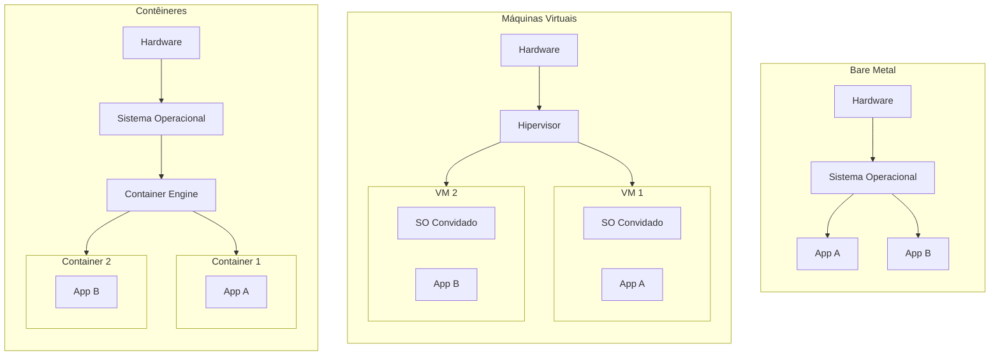

# Contêineres

Nesta seção, abordaremos os conceitos básicos de contêineres, sem entrar nos detalhes de uso de ferramentas específicas como Docker e Kubernetes. O foco está nos conceitos fundamentais e na importância dos contêineres no desenvolvimento de software moderno.

## O que são contêineres?

Um contêiner (_container_) é um ambiente isolado que empacota uma aplicação junto com todas as suas dependências — bibliotecas, binários, arquivos de configuração — em um único pacote executável. Os contêineres são isolados uns dos outros e do sistema operacional host, o que significa que cada contêiner possui suas próprias configurações e dependências, sem interferir em outros contêineres ou no sistema operacional subjacente.

Diferentemente das máquinas virtuais (VMs), que virtualizam todo o sistema operacional, os contêineres compartilham o mesmo núcleo (_kernel_) do sistema operacional host. Isso os torna mais leves e rápidos de iniciar, além de permitir que vários contêineres sejam executados simultaneamente em um único host.

Ao criar um contêiner para uma aplicação e suas dependências, as diferenças entre distribuições de sistemas operacionais e camadas inferiores da infraestrutura são abstraídas. Com isso, os desenvolvedores podem se concentrar em escrever código, sem se preocupar com as diferenças entre os ambientes de desenvolvimento, teste e produção.

### Por que usar contêineres?

Os contêineres oferecem várias vantagens em relação aos métodos tradicionais de desenvolvimento e implantação de aplicativos. Algumas das principais razões para usar contêineres incluem:

- **Consistência**: Os contêineres garantem que o aplicativo funcione da mesma forma em diferentes ambientes, eliminando problemas de "funciona na minha máquina". Isso é especialmente útil quando se trabalha em equipes grandes ou em projetos complexos.
- **Portabilidade**: Os contêineres podem ser executados em qualquer lugar, desde o laptop do desenvolvedor até servidores em nuvem ou ambientes de produção. Isso facilita a migração de aplicativos entre diferentes ambientes e plataformas.
- **Isolamento**: Os contêineres são isolados uns dos outros, o que significa que as dependências e configurações de um contêiner não afetam outros contêineres ou o sistema operacional host. Isso ajuda a evitar conflitos de dependência e facilita o gerenciamento de aplicativos complexos.
- **Eficiência**: Os contêineres são mais leves e rápidos de iniciar do que as máquinas virtuais, permitindo que vários contêineres sejam executados simultaneamente em um único `host`. Isso reduz o uso de recursos e melhora a eficiência geral do sistema.
- **Escalabilidade**: Os contêineres podem ser facilmente escalados para atender à demanda, permitindo que os desenvolvedores aumentem ou diminuam rapidamente a capacidade de um aplicativo conforme necessário. Isso é especialmente útil em ambientes de produção, onde a carga de trabalho pode variar significativamente.
- **Facilidade de gerenciamento**: Os contêineres podem ser facilmente gerenciados e orquestrados usando ferramentas como Docker e Kubernetes, permitindo que os desenvolvedores automatizem tarefas comuns, como implantação, escalonamento e monitoramento de aplicativos.

Os contêineres resolvem o problema de ambientes inconsistentes ao trabalhar em grandes equipes. Antes dos contêineres ou ambientes virtuais, muitos problemas e perda de tempo eram causados pela necessidade de instalar e configurar ambientes locais para construir projetos compartilhados por colegas de trabalho ou amigos.

Dessa forma, os contêineres ajudam a reduzir o tempo de desenvolvimento e a aumentar a eficiência. O uso de contêineres também contribui para reduzir os conflitos entre as equipes de desenvolvimento e operações, separando as áreas de responsabilidade: os desenvolvedores podem se concentrar em seus aplicativos enquanto as equipes de operações cuidam da infraestrutura. No contexto de DevOps, essa separação clara de responsabilidades, aliada à padronização do ambiente de execução, é um dos pilares que viabiliza práticas como integração e entrega contínuas.

Embora o Docker possa ser a ferramenta de contêiner mais conhecida, existem outras opções disponíveis, como Podman, Skopeo, Buildah e CRI-O. Essas ferramentas oferecem funcionalidades semelhantes ao Docker, mas podem ter diferenças em termos de arquitetura, desempenho e recursos específicos.

### Bare Metal vs Virtualização vs Contêineres

`Bare Metal` é um termo usado para descrever um computador que está executando diretamente no hardware, sem nenhuma camada de virtualização. Esta é a maneira com maior desempenho para executar um aplicativo, mas também é a menos flexível. Você só pode executar um sistema operacional por servidor e não pode mover facilmente o aplicativo para outro servidor.

Para resolver esse problema, a virtualização foi introduzida. A virtualização permite que você execute vários sistemas operacionais em um único servidor. A cada uma dessas instâncias de sistema operacional é chamada de máquina virtual (VM). Cada VM é executada em cima de um hipervisor, que é um pedaço de software que emula o hardware de um computador. O hipervisor permite que você execute vários sistemas operacionais em um único servidor e também fornece isolamento entre aplicativos executados em diferentes VMs.

Isso é possível porque o hipervisor emula o hardware de um computador, permitindo que cada VM tenha seu próprio sistema operacional e recursos. Em linhas gerais, o hipervisor `engana` o sistema operacional convidado (VM) para pensar que está executando em um hardware físico, quando na verdade está sendo executado em cima de outro sistema operacional (o hipervisor). No entanto, isso pode levar a uma sobrecarga de desempenho, pois o hipervisor precisa gerenciar os recursos do hardware subjacente e alocar esses recursos para cada VM. Além disso, o hipervisor pode introduzir latência e reduzir o desempenho geral do sistema.

Já os contêineres são uma maneira de executar vários aplicativos em um único servidor sem a sobrecarga de um hipervisor. Cada contêiner é executado em cima de um mecanismo de contêiner (software que gerencia o ciclo de vida dos contêineres), que supervisiona e isola processos usando os recursos do núcleo do sistema operacional host.

Dessa forma, os contêineres compartilham o mesmo núcleo do sistema operacional host, mas cada contêiner tem seu próprio sistema de arquivos, rede e processos. Isso significa que os contêineres são mais leves e rápidos de iniciar do que as VMs, pois não precisam emular todo o hardware de um computador. Além disso, os contêineres podem ser facilmente movidos entre diferentes servidores e ambientes, tornando-os mais portáteis e flexíveis. Por outro lado, como todos os contêineres usam o mesmo núcleo do sistema operacionais, não é possível que cada contêiner tenha seu próprio sistema operacional. Isso pode levar a problemas de compatibilidade entre aplicativos que exigem diferentes versões do núcleo do sistema operacional.

O diagrama abaixo ilustra as diferenças entre as três abordagens:

```mermaid
flowchart TB
  subgraph BM["Bare Metal"]
    direction TB
    HW1["Hardware"]
    OS1["Sistema Operacional"]
    A1["App A"]
    A2["App B"]
    HW1 --> OS1 --> A1
    OS1 --> A2
  end
  subgraph VM["Máquinas Virtuais"]
    direction TB
    HW2["Hardware"]
    HV["Hipervisor"]
    subgraph VM1["VM 1"]
      GOS1["SO Convidado"]
      VA1["App A"]
    end
    subgraph VM2["VM 2"]
      GOS2["SO Convidado"]
      VA2["App B"]
    end
    HW2 --> HV --> VM1
    HV --> VM2
  end
  subgraph CT["Contêineres"]
    direction TB
    HW3["Hardware"]
    OS3["Sistema Operacional"]
    CE["Container Engine"]
    subgraph C1["Container 1"]
      CA1["App A"]
    end
    subgraph C2["Container 2"]
      CA2["App B"]
    end
    HW3 --> OS3 --> CE --> C1
    CE --> C2
  end
```

### Breve história dos contêineres

A ideia de isolar processos não é nova. A evolução até os contêineres modernos passou por vários marcos importantes:

- **1979 — `chroot`**: O Unix V7 introduziu a chamada de sistema `chroot`, que permite alterar o diretório raiz de um processo, criando um ambiente de sistema de arquivos isolado. Foi a primeira forma de isolamento de processos.
- **2000 — FreeBSD Jails**: O FreeBSD estendeu o conceito de `chroot` para criar "jails" — ambientes completamente isolados com seus próprios usuários, rede e sistema de arquivos.
- **2006 — cgroups**: O Google desenvolveu os _control groups_ (cgroups) para o kernel Linux, permitindo limitar e monitorar o uso de recursos (CPU, memória, I/O) por grupos de processos.
- **2008 — LXC (Linux Containers)**: O LXC combinou namespaces e cgroups do kernel Linux para criar contêineres completos, sem a necessidade de um hipervisor.
- **2013 — Docker**: A dotCloud (posteriormente renomeada Docker, Inc.) lançou o Docker, que tornou os contêineres acessíveis a desenvolvedores comuns ao simplificar a criação, distribuição e execução de contêineres com Dockerfiles e o Docker Hub.
- **2015 — OCI**: A criação da Open Container Initiative padronizou os formatos de imagem e runtime, garantindo interoperabilidade entre diferentes ferramentas.
- **2014-2015 — Kubernetes**: O Google abriu o código do Kubernetes, um sistema para orquestrar contêineres em escala, que se tornou o padrão da indústria.

Essa linha do tempo mostra que os contêineres são resultado de décadas de evolução em técnicas de isolamento de processos no Unix e no Linux.

### Open Container Initiative (OCI)

A Open Container Initiative (OCI) é uma organização que visa criar padrões abertos para contêineres. A OCI foi criada em 2015 como parte da Linux Foundation e tem como objetivo promover a interoperabilidade entre diferentes ferramentas e plataformas de contêineres.

A OCI define dois padrões principais:

- **Runtime Specification**: Define como os contêineres devem ser executados em um ambiente de contêiner. Isso inclui detalhes sobre como os contêineres devem ser iniciados, parados e gerenciados, bem como como os recursos do sistema devem ser alocados para os contêineres.
- **Image Specification**: Define como as imagens de contêiner devem ser formatadas e armazenadas. Isso inclui detalhes sobre como as imagens devem ser empacotadas, versionadas e distribuídas.

Esses padrões ajudam a garantir que diferentes ferramentas e plataformas de contêineres possam trabalhar juntas de forma interoperável. Isso significa que os desenvolvedores podem usar diferentes ferramentas para criar, executar e gerenciar contêineres, sem se preocupar com problemas de compatibilidade.

A Docker foi uma das primeiras empresas a adotar os padrões da OCI e tem trabalhado em estreita colaboração com a OCI para promover a interoperabilidade entre diferentes ferramentas de contêineres. Outras empresas, como Red Hat, Google e Microsoft, também estão envolvidas na OCI e apoiam seus esforços para criar padrões abertos para contêineres.

Na prática, isso significa que uma imagem construída com Docker pode ser executada com Podman (e vice-versa), pois ambas as ferramentas seguem a OCI Image Specification. Da mesma forma, o _runtime_ `runc` pode ser substituído por outro _runtime_ compatível com a OCI, sem alterar a imagem ou o fluxo de trabalho.

## As tecnologias que dão vida aos contêineres

O conceito de contêineres é suportado por várias tecnologias que permitem a criação, execução e gerenciamento de contêineres. Entre essas tecnologias, podemos citar as duas principais, que são:

- **Namespaces**: Os namespaces são uma característica do núcleo do Linux que permite isolar processos e recursos em diferentes contêineres. Cada contêiner tem seu próprio namespace, o que significa que os processos em um contêiner não podem ver ou interagir com os processos em outro contêiner.
- **Cgroups**: Os cgroups (control groups) são outra característica do núcleo do Linux que permite limitar e monitorar o uso de recursos (como CPU, memória e disco) por processos em um contêiner. Isso ajuda a garantir que os contêineres não consumam mais recursos do que o necessário e permite que os desenvolvedores definam limites para cada contêiner.

Outras tecnologias também são importantes para o funcionamento dos contêineres, como:

- **UnionFS**: O UnionFS é um sistema de arquivos que permite empilhar vários sistemas de arquivos em um único sistema de arquivos. Isso é útil para criar imagens de contêiner, pois permite que os desenvolvedores empilhem diferentes camadas de arquivos e dependências em uma única imagem.
- **Containerd**: O Containerd é um daemon de contêiner que fornece uma API para criar, executar e gerenciar contêineres. Ele é usado por várias ferramentas de contêiner, incluindo o Docker, e fornece uma interface comum para trabalhar com contêineres.
- **runc**: O runc é um runtime de contêiner que implementa os padrões da OCI. Ele é usado pelo Docker e outras ferramentas de contêiner para executar contêineres. O runc é responsável por criar e gerenciar os namespaces, cgroups e sistemas de arquivos necessários para executar um contêiner.

Nas próximas seções, exploraremos os namespaces e os cgroups em detalhe, com explicações conceituais e exercícios práticos no terminal.
