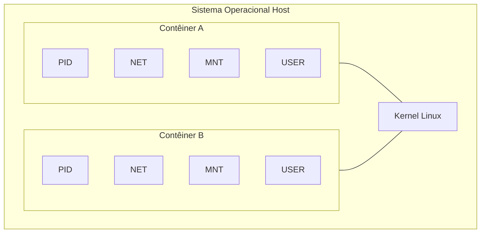

# Namespaces

Na seção anterior, vimos uma visão geral das tecnologias que sustentam os contêineres. Agora vamos aprofundar nos **namespaces**, o mecanismo do kernel Linux responsável pelo **isolamento** — ou seja, controlar _o que_ cada processo enxerga do sistema.

## O que são namespaces?

Os namespaces são uma característica do núcleo do Linux que permite isolar processos e recursos em diferentes contêineres. Cada contêiner tem seu próprio namespace, o que significa que os processos em um contêiner não podem ver ou interagir com os processos em outro contêiner. Isso é fundamental para garantir o isolamento entre contêineres e evitar conflitos de dependência.

Os namespaces são usados para isolar diferentes recursos do sistema, como:

- **PID namespace**: Isola os IDs de processo (PIDs) entre contêineres, permitindo que cada contêiner tenha seu próprio conjunto de processos.
- **Network namespace**: Isola as interfaces de rede entre contêineres, permitindo que cada contêiner tenha sua própria pilha de rede e endereços IP.
- **Mount namespace**: Isola os pontos de montagem entre contêineres, permitindo que cada contêiner tenha seu próprio sistema de arquivos.
- **User namespace**: Isola os IDs de usuário e grupo entre contêineres, permitindo que cada contêiner tenha seu próprio conjunto de usuários e permissões.
- **IPC namespace**: Isola os recursos de comunicação entre processos (IPC) entre contêineres, permitindo que cada contêiner tenha seu próprio conjunto de recursos IPC.
- **UTS namespace**: Isola os nomes de host e domínio entre contêineres, permitindo que cada contêiner tenha seu próprio nome de host e domínio. O nome UTS vem de _UNIX Time-Sharing System_, uma referência histórica à estrutura `utsname` do kernel.
- **Cgroup namespace**: Isola os grupos de controle (cgroups) entre contêineres, permitindo que cada contêiner tenha seu próprio conjunto de cgroups.
- **Time namespace**: Isola o tempo entre contêineres, permitindo que cada contêiner tenha seu próprio relógio e fuso horário.
  Além dos namespaces listados acima, é comum mencionar o **Seccomp** (_Secure Computing Mode_) ao discutir o isolamento de contêineres. Contudo, o Seccomp **não é um namespace** — trata-se de um mecanismo do kernel Linux para filtrar chamadas de sistema (_syscalls_), restringindo quais operações um processo pode executar. Ele atua como uma camada adicional de segurança, complementando o isolamento proporcionado pelos namespaces.

A imagem abaixo ilustra como esses recursos estão isolados dentro de um namespace:



## Criando um ambiente isolado com namespace

No Linux, você pode criar um ambiente isolado usando namespaces com o comando `unshare`. O comando `unshare` permite que você execute um comando em um novo namespace, isolando-o do restante do sistema. Isso é útil para testar e desenvolver aplicativos em um ambiente isolado.

Neste exemplo, criaremos um novo namespace de PID, rede e sistema de montagem, e iniciaremos um bash dentro desse ambiente isolado.

```bash
sudo unshare -p -m -n -f --mount-proc bash
```

Vamos analisar os parâmetros usados:

- `-p`: Cria um novo namespace de PID, onde os processos terão IDs independentes do sistema principal.
- `-m`: Cria um novo namespace de montagem, isolando o sistema de arquivos.
- `-n`: Cria um novo namespace de rede, isolando as interfaces de rede.
- `-f`: Força a criação do novo processo no namespace.
- `--mount-proc`: Monta o sistema de arquivos `/proc` dentro do namespace, permitindo visualizar apenas os processos do ambiente isolado.
- `bash`: O comando a ser executado dentro do novo namespace.

Após executar o comando, você terá um shell bash dentro de um novo namespace de PID, rede e sistema de montagem. Isso significa que qualquer processo iniciado dentro desse shell não terá acesso aos processos ou recursos do sistema principal.

Para verificar o isolamento, execute o comando `ps aux` **dentro** do namespace:

```bash
ps aux
```

Você verá que apenas o processo `bash` (PID 1) e o próprio `ps` aparecem listados. Compare essa saída abrindo outro terminal (fora do namespace) e executando o mesmo `ps aux` — a lista de processos será significativamente maior.

Outra forma de observar o isolamento é verificar a rede. Dentro do namespace, execute:

```bash
ip link show
```

Você verá apenas a interface `lo` (loopback), pois o namespace de rede está isolado e não possui acesso às interfaces de rede do host.

Para sair do namespace, basta executar:

```bash
exit
```

Da parte externa do namespace, você pode verificar os processos em execução usando o comando `ps`. Nesse caso, queremos identificar o PID do bash que foi iniciado dentro do namespace. Para isso, você pode usar o comando `ps` com a opção `-ef` para listar todos os processos em execução:

```bash
 ps -ef | grep unshare
```

Com esse comando, você verá uma lista de processos em execução e poderá identificar o PID do processo `unshare`. O PID do bash iniciado dentro do namespace será um filho desse processo. Uma forma de visualizar isso é usando o comando `pstree`, que exibe a árvore de processos:

```bash
pstree -p <PID_IDENTIFICADO_AO_COMANDO_UNSHARE> # (1)
```

1. Substitua `<PID_IDENTIFICADO_AO_COMANDO_UNSHARE>` pelo PID do processo `unshare` que você encontrou na etapa anterior. O PID do bash será listado como um filho do processo `unshare`.

## Exercício opcional: isolando o hostname com UTS namespace

O UTS namespace permite que cada contêiner tenha seu próprio nome de host, independente do host real. Vamos experimentar isso na prática.

**Passo 1**: Crie um novo namespace de UTS junto com os demais:

```bash
sudo unshare -p -m -n -u -f --mount-proc bash
```

O parâmetro `-u` cria um novo UTS namespace. Dentro do namespace, verifique o hostname atual:

```bash
hostname
```

Você verá o mesmo hostname do host, pois o namespace herda o valor original no momento da criação.

**Passo 2**: Altere o hostname dentro do namespace:

```bash
hostname meu-container
hostname
```

A saída agora mostrará `meu-container`.

**Passo 3**: Em outro terminal (fora do namespace), verifique que o hostname do host **não foi alterado**:

```bash
hostname
```

Ele continuará com o nome original do host. Isso demonstra o isolamento do UTS namespace — a alteração do hostname dentro do namespace não afeta o sistema host.

Esse é exatamente o comportamento que ferramentas como o Docker usam internamente: cada contêiner recebe seu próprio UTS namespace, e o Docker define o hostname do contêiner como o ID curto do contêiner (ou o valor passado pela opção `--hostname`).
