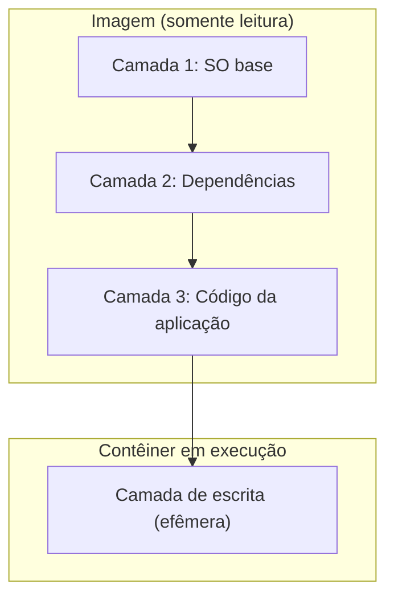
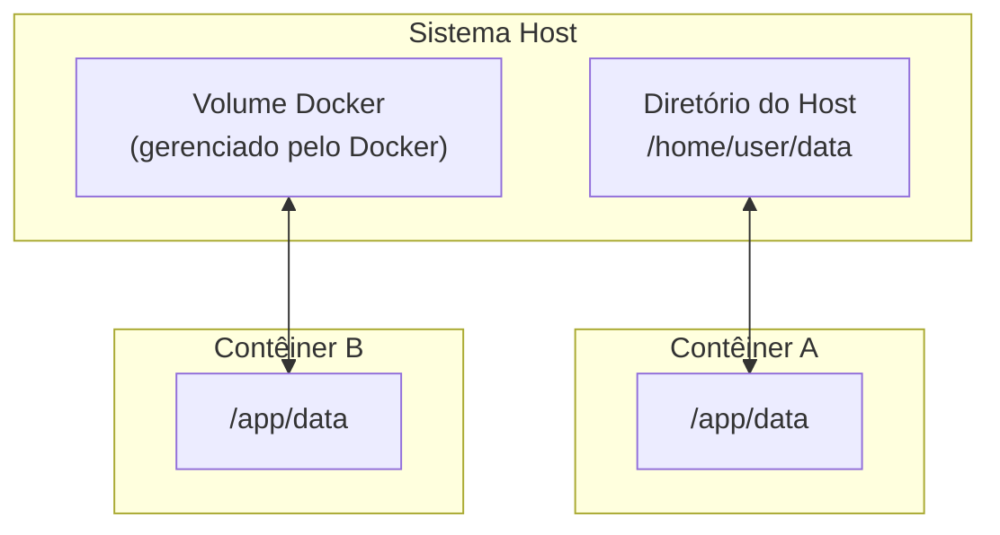

# Persistência de dados

No capítulo anterior, vimos que os contêineres Docker são baseados em imagens imutáveis compostas por camadas. Ao executar um contêiner, o Docker cria uma **camada de leitura e gravação** sobreposta às camadas da imagem, usando um sistema de arquivos de sobreposição (_overlay filesystem_, baseado em UnionFS). Essa camada permite que o contêiner crie, modifique e exclua arquivos durante sua execução — mas ela é descartada quando o contêiner é removido.

Essa é a razão pela qual o armazenamento dentro de um contêiner é **efêmero**: qualquer alteração ou modificação de dados feita dentro de um contêiner só está disponível enquanto o contêiner existir. Uma vez que o contêiner é parado e removido, todos os dados da camada de escrita são perdidos.



Embora essa natureza efêmera seja adequada para muitos cenários, ela se torna um problema quando precisamos persistir dados entre ciclos de vida dos contêineres. Por exemplo, se você reiniciar um contêiner de banco de dados, não deseja começar com um banco de dados vazio. Portanto, como persistir arquivos?

## Bind mounts e Volumes

Existem duas abordagens principais para persistir dados em contêineres Docker:

1. **Bind mounts**: Montam um diretório específico do host diretamente dentro do contêiner.

2. **Volumes**: Mecanismo gerenciado pelo Docker, armazenado fora do sistema de arquivos do contêiner e que pode ser compartilhado entre vários contêineres.

O diagrama abaixo ilustra a diferença entre as duas abordagens:



A tabela abaixo compara as duas abordagens:

| Característica      | Bind mount                              | Volume                                           |
| ------------------- | --------------------------------------- | ------------------------------------------------ |
| Gerenciamento       | Manual (pelo usuário)                   | Gerenciado pelo Docker                           |
| Localização no host | Caminho definido pelo usuário           | Diretório interno do Docker                      |
| Portabilidade       | Depende do caminho no host              | Portável entre ambientes                         |
| Compartilhamento    | Entre contêineres no mesmo host         | Entre contêineres, com suporte a drivers remotos |
| Uso recomendado     | Desenvolvimento (código-fonte, configs) | Produção (bancos de dados, dados persistentes)   |

### Bind mounts

Os bind mounts permitem que você monte um diretório do host dentro de um contêiner. Isso significa que qualquer alteração feita no diretório do host será refletida no contêiner e vice-versa. Para usar um bind mount, você pode usar a opção `-v` com o caminho do diretório do host:

```bash
docker run -d -p 8001:80 -v /path/to/host/directory:/usr/share/nginx/html nginx
```

Isso montará o diretório `/path/to/host/directory` do host no diretório `/usr/share/nginx/html` dentro do contêiner Nginx. Qualquer arquivo criado ou modificado nesse diretório será persistido no diretório do host, mesmo que o contêiner seja removido.

É importante notar que os bind mounts não são gerenciados pelo Docker e podem ser mais difíceis de gerenciar do que os volumes. Além disso, os bind mounts podem apresentar problemas de portabilidade, pois dependem do caminho do diretório no host.

!!!example annotate "Bind mounts na prática"

    Vamos fazer um exemplo de modificação no Nginx. Siga os seguintes passos:


    - [x] Vamos criar uma pasta para o nosso projeto, por exemplo `docker-nginx`
    - [x] Abra esse diretório no Visual Studio Code ou no editor de sua preferência.
    - [x] Crie um sub-diretório com o nome `html` dentro de `docker-nginx`:
    - [x] Crie um arquivo `index.html` dentro do diretório `html` com o seguinte conteúdo:

    ```html
    <!DOCTYPE html>
    <html lang="pt-BR">
    <head>
        <meta charset="UTF-8">
        <meta name="viewport" content="width=device-width, initial-scale=1.0">
        <title>Docker Nginx</title>
    </head>
    <body>
        <h1>Bem-vindo ao Docker Nginx!</h1>
        <p>Este é um exemplo de página servida pelo Nginx em um contêiner Docker.</p>
    </body>
    </html>
    ```

    - [x] Agora, execute o seguinte comando no terminal:

    ```bash
    docker run -p 8001:80 -v $(pwd)/html:/usr/share/nginx/html nginx # (1)
    ```

    - [x] Agora, abra o navegador e acesse `http://localhost:8001`. Você verá a página HTML que você criou no diretório `html` do host.

    - [x] Agora, faça uma alteração no arquivo `index.html` e salve. Você verá que a página no navegador será atualizada automaticamente com as alterações feitas no arquivo `index.html` do host.

1. :man_raising_hand: Isso iniciará um contêiner Nginx, mapeando a porta 80 do contêiner para a porta 8001 do host e montando o diretório `html` do host no diretório `/usr/share/nginx/html` dentro do contêiner. Lembre-se que este diretório é onde o Nginx procura os arquivos HTML para servir.

### Volumes

Os volumes são gerenciados pelo Docker e podem ser facilmente criados, removidos e compartilhados. Para criar um volume, você pode usar o seguinte comando:

```bash
docker volume create <volume_name>
```

Para usar um volume ao executar um contêiner, você pode usar a opção `-v`:

```bash
docker run -d -p 8001:80 -v <volume_name>:/usr/share/nginx/html nginx
```

Isso montará o volume `<volume_name>` no diretório `/usr/share/nginx/html` dentro do contêiner Nginx. Qualquer arquivo criado ou modificado nesse diretório será persistido no volume, mesmo que o contêiner seja removido.

Para colocar em prática, vamos usar o exemplo de um contêiner com um servidor de banco de dados PostgreSQL. Como comentado anteriormente, se você reiniciar um contêiner de banco de dados, pode não querer começar com um banco de dados vazio. Dessa forma, o uso de volumes pode ser uma boa solução.

!!!example annotate "Volumes na prática"

    Vamos fazer um exemplo de persistência de dados com o PostgreSQL. Siga os seguintes passos:

    - [x] Primeiro vamos criar um volume com o nome `pgdata`:

    ```bash
    docker volume create pgdata
    ```

    - [x] Agora vamos executar um contêiner PostgreSQL, mapeando o volume `pgdata` para o diretório `/var/lib/postgresql/data` dentro do contêiner:

    ```bash
    docker run -d \
        --name postgres \
        -e POSTGRES_USER=postgres \
        -e POSTGRES_PASSWORD=postgres \
        -p 5432:5432 \
        -v pgdata:/var/lib/postgresql/data \
        postgres # (1)
    ```
    - [x] Agora, você pode acessar o banco de dados PostgreSQL usando um cliente de banco de dados, como o DBeaver ou o pgAdmin, usando as seguintes credenciais:

    ```
    Host: localhost
    Porta: 5432
    Usuário: postgres
    Senha: postgres
    ```

    - [x] Todas as alterações que você fizer no banco de dados serão persistidas no volume `pgdata`, mesmo que o contêiner seja removido.
    - [x] Para parar o contêiner, você pode usar o seguinte comando:

    ```bash
    docker container stop postgres
    ```

1. Note que estamos usando a imagem oficial do PostgreSQL e mapeando o volume `pgdata` para o diretório `/var/lib/postgresql/data` dentro do contêiner. Esse diretório é onde o PostgreSQL armazena os dados do banco de dados. Isso garante que os dados persistam mesmo que o contêiner seja removido. Também estamos mapeando a porta 5432 do contêiner para a porta 5432 do host, permitindo que você acesse o banco de dados a partir do host.

Os volumes são administrados pelo Docker e podem ser facilmente criados, removidos e compartilhados entre contêineres. Você pode listar os volumes disponíveis em sua máquina local usando o seguinte comando:

```bash
docker volume ls
```

Isso exibirá uma tabela com informações sobre os volumes disponíveis, incluindo o nome e o driver do volume.

Uma informação importante é que os dados do volume não ficam armazenados dentro do contêiner, mas sim em um diretório específico no host. O Docker gerencia esse diretório e garante que os dados sejam persistidos mesmo que o contêiner seja removido. Isso significa que você pode remover um contêiner e ainda ter acesso aos dados armazenados no volume.

Para visualizar o local dos dados do volume no host, você pode usar o seguinte comando:

```bash
docker volume inspect <volume_name>
```

Isso exibirá informações detalhadas sobre o volume, incluindo o caminho no host onde os dados estão armazenados. O caminho pode variar dependendo do sistema operacional e da configuração do Docker.

### Exercício: verificando a persistência de dados

Para comprovar que os dados realmente persistem após a remoção de um contêiner, vamos realizar o seguinte exercício usando o contêiner PostgreSQL criado anteriormente.

**Passo 1**: Com o contêiner PostgreSQL em execução, conecte-se ao banco de dados e crie uma tabela com alguns dados. Você pode usar o comando `docker exec` para executar o cliente `psql` dentro do contêiner:

```bash
docker exec -it postgres psql -U postgres
```

Dentro do `psql`, execute:

```sql
CREATE TABLE alunos (id SERIAL PRIMARY KEY, nome VARCHAR(100));
INSERT INTO alunos (nome) VALUES ('Maria'), ('João'), ('Ana');
SELECT * FROM alunos;
\q
```

**Passo 2**: Pare e remova o contêiner:

```bash
docker container stop postgres
docker container rm postgres
```

**Passo 3**: Crie um novo contêiner apontando para o **mesmo volume** `pgdata`:

```bash
docker run -d \
    --name postgres \
    -e POSTGRES_USER=postgres \
    -e POSTGRES_PASSWORD=postgres \
    -p 5432:5432 \
    -v pgdata:/var/lib/postgresql/data \
    postgres
```

**Passo 4**: Verifique que os dados persistiram:

```bash
docker exec -it postgres psql -U postgres -c "SELECT * FROM alunos;"
```

Você verá que a tabela `alunos` e os dados inseridos anteriormente ainda estão disponíveis, mesmo que o contêiner original tenha sido completamente removido. Isso confirma que os volumes armazenam os dados de forma independente do ciclo de vida dos contêineres.
