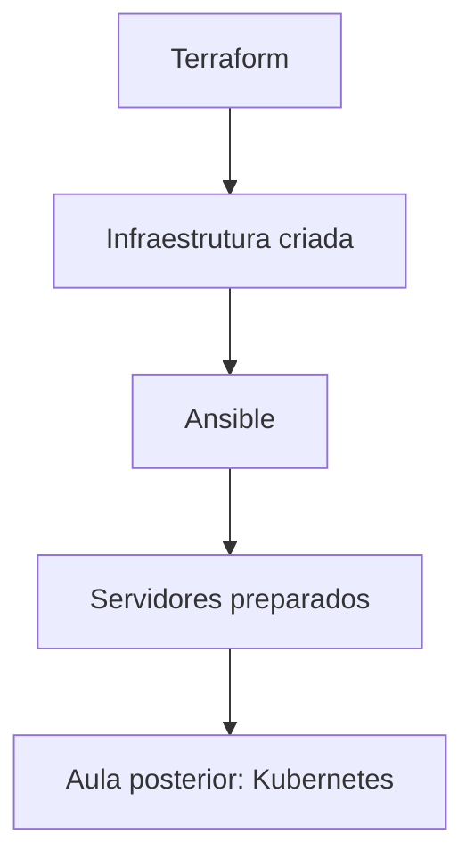

# Conceitos e fundamentos

Infraestrutura como Código (IaC) é a prática de definir e gerenciar infraestrutura usando arquivos de configuração legíveis por humanos. Isso traz muitos benefícios, como:
- Repetibilidade: você pode criar o mesmo ambiente várias vezes.
- Versionamento: mudanças na infraestrutura ficam registradas no controle de versão.
- Automação: tarefas manuais são substituídas por processos automatizados.
- Consistência: evita divergências entre ambientes.
- Colaboração: equipes podem trabalhar juntas no mesmo código de infraestrutura.

Nos últimos anos, ferramentas como Terraform e Ansible se tornaram populares para implementar IaC. O Terraform é focado em provisionamento de infraestrutura, enquanto o Ansible é mais voltado para configuração de sistemas. Juntos, eles permitem criar e configurar ambientes completos de forma eficiente e controlada.

Numa estrutura clássica, o administrador de sistemas faz a instalação e configuração dos servidores manualmente, o que pode levar a erros e inconsistências. Com IaC, o código define exatamente como os servidores devem ser provisionados e configurados, garantindo que o ambiente seja sempre o mesmo, independentemente de quem o criou.

Mesmo que você coloque os seus servidores na nuvem (AWS, Azure, GCP), a prática de IaC é essencial para garantir que a infraestrutura seja gerenciada de forma eficiente e segura. Em ambientes de produção, o uso de IaC é fundamental para manter a confiabilidade e a escalabilidade dos sistemas.

Quando a infraestrutura é criada manualmente no painel da nuvem, os problemas aparecem rápido:

- Ambientes diferentes sem querer
- Mudanças sem histórico claro
- Falhas por esquecimento de configuração
- Dificuldade para repetir um setup

Infraestrutura como Código resolve isso com definição declarativa, versionamento e automação.

## Conceitos principais

**Infraestrutura como Código (IaC)**
: Prática de descrever infraestrutura em arquivos versionados.

**Provisionamento**
: Criação de recursos de infraestrutura (exemplo: EC2, rede, security group).

**Configuração**
: Ajustes no sistema operacional e serviços dentro dos servidores (exemplo: pacotes, usuários, SSH).

**Idempotência**
: Executar o mesmo código várias vezes e chegar no mesmo resultado esperado.

**Automação**
: Substituir tarefas manuais repetitivas por processos reproduzíveis.

## Responsabilidades no nosso contexto

- Terraform: provisionamento da infraestrutura
- Ansible: configuração dos servidores
- Kubernetes: instalação em etapa posterior

## Fluxo macro da aula

1. Obter credenciais temporárias do AWS Learner Lab.
2. Provisionar EC2 e Security Groups com Terraform.
3. Exportar IPs via outputs.
4. Configurar os hosts com Ansible.
5. Validar conectividade e estado base dos servidores.
