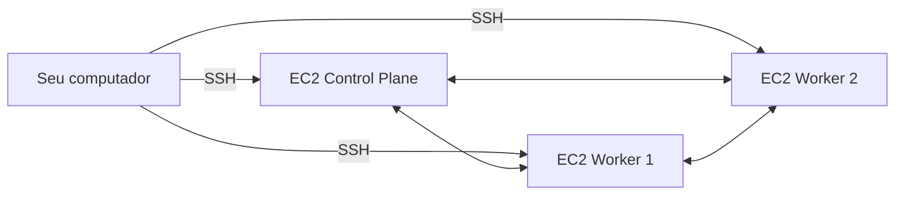

# Infraestrutura como Código (IaC)

Nesta aula, vamos estudar  os fundamentos e a prática de IaC (Infraestrutura como Código). Vamos aprender a usar Terraform para provisionar infraestrutura na AWS e Ansible para configurar os servidores. O ambiente será o AWS Learner Lab, que oferece recursos temporários para prática, como já vimos nas aulas anteriores.

Nesta etapa, o foco não é instalar Kubernetes ainda. O foco é:

- Provisionar infraestrutura com Terraform
- Configurar servidores com Ansible
- Trabalhar no contexto do AWS Learner Lab

## Objetivos de aprendizagem

Ao final desta trilha, você deverá ser capaz de:

- Entender o conceito de Infraestrutura como Código
- Diferenciar provisionamento de configuração
- Utilizar Terraform para criar recursos na AWS
- Utilizar Ansible para configurar servidores Linux
- Entender a integração entre Terraform e Ansible
- Preparar servidores para uma futura instalação de Kubernetes

## Cenário padrão

- AWS EC2
- 1 servidor Control Plane
- 2 servidores Workers
- Ubuntu Server
- Rede privada entre os servidores
- Acesso SSH
- Security Groups adequados

