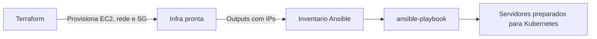

# Integração Terraform + Ansible

## Papel de cada ferramenta

- Terraform: cria a infraestrutura
- Ansible: configura a infraestrutura
- Kubernetes: será instalado depois

## Fluxo recomendado

1. Validar credenciais do Learner Lab.
2. Executar Terraform e criar recursos.
3. Coletar outputs de IPs.
4. Atualizar inventário do Ansible.
5. Executar playbook de configuração.
6. Validar SSH e estado final dos hosts.

## Resultado esperado

Ao final, você tem 3 servidores provisionados e configurados, prontos para a etapa de instalação do Kubernetes nas próximas aulas.
