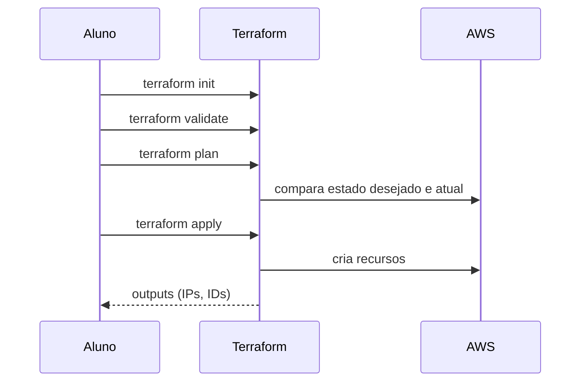

# Terraform para provisionamento

Terraform é uma ferramenta de provisionamento declarativo. Você define o estado desejado da infraestrutura e o Terraform calcula o que precisa criar, alterar ou remover.

O Terraforma foi criado pela HashiCorp e é amplamente utilizado para gerenciar infraestrutura em nuvem, incluindo AWS, Azure, GCP e muitos outros provedores. Ele é baseado em arquivos de configuração escritos em HCL (HashiCorp Configuration Language), que são fáceis de ler e escrever. O Terraform é idempotente, o que significa que você pode aplicar o mesmo código várias vezes sem causar mudanças indesejadas, desde que o estado desejado já tenha sido alcançado.

Vamos fixar os conceitos de Terraform e praticar o provisionamento de infraestrutura na AWS usando o AWS Learner Lab. O foco é criar os recursos necessários para a instalação do Kubernetes, como instâncias EC2, redes e security groups, utilizando o Terraform.

## Conceitos fundamentais

**Provider**
: Plugin que conecta o Terraform ao provedor de nuvem. Existem providers para AWS, Azure, GCP, entre outros. Também existem providers para serviços específicos, como Kubernetes, Ansible, etc.

**Resources**
: Recursos de infraestrutura definidos em código. Alguns exemplos incluem `aws_instance`, `aws_security_group`, `aws_vpc`, etc. Cada recurso tem atributos que definem suas propriedades, como tipo de instância, AMI, regras de firewall, etc. Os recursos são a base do código Terraform, pois representam os componentes reais da infraestrutura que serão criados, modificados ou destruídos. Eles são disponibilizados pelo provider e são configurados usando blocos de código que especificam suas características e dependências.

**State**
: Registro do que foi criado e do estado atual da infraestrutura. O Terraform usa o state para comparar o que existe com o que está definido no código e determinar as ações necessárias para alcançar o estado desejado. O state é armazenado localmente ou remotamente (exemplo: S3, Terraform Cloud) e é essencial para o funcionamento do Terraform, pois sem ele, a ferramenta não saberia quais recursos já existem ou quais mudanças precisam ser aplicadas.

**Outputs**
: Valores exportados após o apply, como IPs e IDs. Esses outputs podem ser usados para integração com outras ferramentas, como Ansible, ou para referência futura. Eles são definidos em blocos de código específicos e podem incluir informações como endereços IP públicos, IDs de instâncias, URLs de serviços, entre outros dados relevantes que foram criados ou modificados durante o processo de provisionamento.

**Variáveis**
: Parâmetros para evitar hardcode e facilitar reuso. As variáveis permitem que você defina valores dinâmicos para os recursos, tornando o código mais flexível e reutilizável. Elas podem ser definidas em arquivos separados (exemplo: `variables.tf`) e preenchidas em arquivos de variáveis (exemplo: `terraform.tfvars`), ou diretamente no código. O uso de variáveis é uma prática recomendada para evitar hardcoding de valores específicos, como nomes de instâncias, tipos de recursos, regiões, etc., facilitando a manutenção e a adaptação do código para diferentes ambientes ou cenários.

## AWS Learner Lab: credenciais temporárias

No Learner Lab, as credenciais expiram. Sempre que isso acontecer, renove os dados no painel AWS Details e exporte novamente no terminal:

```bash
export AWS_ACCESS_KEY_ID="SEU_ACCESS_KEY"
export AWS_SECRET_ACCESS_KEY="SEU_SECRET_KEY"
export AWS_SESSION_TOKEN="SEU_SESSION_TOKEN"
export AWS_DEFAULT_REGION="us-east-1"
```

!!! warning "Importante"

    Erros de autenticação no Terraform normalmente indicam token expirado.

## Estrutura recomendada

Abaixo está uma estrutura de pastas recomendada para organizar o código Terraform:

```text
iac/
  terraform/
    main.tf
    variables.tf
    outputs.tf
    terraform.tfvars
    terraform.tfvars.example
```

## Exemplo de recursos do cenário

- Provider AWS
- Security Group para SSH + tráfego interno
- 3 instâncias EC2 (1 control plane + 2 workers)
- Outputs para IPs públicos e privados

## Comandos essenciais

Abaixo, uma lista dos comandos essenciais para trabalhar com Terraform:

- `terraform init`: Inicializa o diretório de trabalho, baixando os providers necessários.
- `terraform fmt -recursive`: Formata o código de forma consistente.
- `terraform validate`: Verifica se a configuração é válida.
- `terraform plan -out tfplan`: Gera um plano de execução e salva em um arquivo chamado `tfplan`.
- `terraform apply tfplan`: Aplica o plano de execução salvo no arquivo `tfplan`.
- `terraform destroy`: Destrói os recursos criados pelo Terraform.

Note que essa lista não é exaustiva, mas cobre os comandos mais comuns usados durante o desenvolvimento e manutenção de código Terraform. O uso do `terraform plan` é especialmente importante para revisar as mudanças antes de aplicá-las, garantindo que você tenha controle total sobre o que será criado, modificado ou destruído na sua infraestrutura.

Abaixo está um diagrama de sequência que ilustra o fluxo de trabalho típico ao usar Terraform para provisionar infraestrutura:


